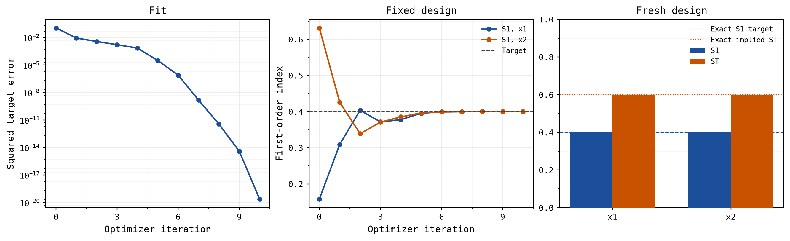

# Fit input ranges to target Sobol indices

This example uses gradients to find input ranges that produce a chosen
sensitivity profile. We keep a toy model fixed and adjust the uncertainty
assigned to its two inputs.

The target is a first-order Sobol index of **0.4 for each input**: each input
should account for 40% of output variance on its own. For this two-input model,
the remaining 20% belongs to their interaction.

The full script is
[`examples/inverse_sobol_bounds.py`](https://github.com/DanielePessina/jaxgsa/blob/master/examples/inverse_sobol_bounds.py).
From a repository checkout with the examples dependencies installed, run:

```bash
uv run --locked examples/inverse_sobol_bounds.py
```

It saves a plot and a JSON report under `.scratch/inverse-sobol-bounds/`.
The snippets below can also be run in order; plotting is only in the full script.

## Define the model and starting ranges

Use independent, dimensionless inputs with symmetric uniform distributions:

$$
X_i\sim U(-w_i,w_i),\qquad Y=X_1+X_2+X_1X_2.
$$

Here $w_i$ is a positive half-width. The first two model terms are individual
effects. The product is an interaction: the effect of one input depends on the
other input's value.

```python
import jax
import jax.numpy as jnp
import numpy as np
from numpy.typing import NDArray
from scipy.optimize import minimize

import jaxgsa

jax.config.update("jax_enable_x64", True)
FloatArray = NDArray[np.float64]


def model(x: jax.Array) -> jax.Array:
    x1, x2 = x[:, 0], x[:, 1]
    return x1 + x2 + x1 * x2


problem = jaxgsa.Problem.from_dict({"x1": (-1.0, 1.0), "x2": (-2.0, 2.0)})
initial_widths = jnp.array([1.0, 2.0])
target = jnp.array([0.4, 0.4])

design = jaxgsa.sobol.sample(
    problem, n_samples=16384, base_n=4096,
    calc_second_order=False, seed=42, verbose=False,
)
initial_result = jaxgsa.sobol.analyze(
    design, model(jnp.asarray(design.samples)), verbose=False,
)
assert isinstance(initial_result, jaxgsa.sobol.SobolResult)
print(np.asarray(initial_result.S1))
```

The starting indices are approximately `[0.158, 0.632]`. Input 2 has a much
larger individual contribution. `base_n=4096` is the base design size; the
Saltelli construction expands it into the model evaluation rows.

## Connect widths to indices

Build the sampling design once. `transform()` maps its fixed unit-cube points
into new input ranges, and the model evaluates those new points on every call.
Use `sobol.indices()` inside the differentiable computation; it returns arrays
without the host-side diagnostics performed by `analyze()`.

```python
def first_order(widths: jax.Array) -> jax.Array:
    theta = {
        name: {"low": -widths[i], "high": widths[i]}
        for i, name in enumerate(problem.names)
    }
    x = design.transform(theta)
    return jaxgsa.sobol.indices(design, model(x))[0]


jacobian = jax.jacrev(first_order)(initial_widths)
print(np.asarray(jacobian))
```

```text
[[ 0.19954 -0.13295]
 [-0.46529  0.09973]]
```

Rows identify the reported indices; columns identify the widths. For example,
the bottom-left entry says that a small increase in $w_1$ decreases input 2's
first-order index. Both indices respond because they share the output variance
in their denominator.

These derivatives pass through the entire computation:

$$
\text{widths}\longrightarrow\text{samples}\longrightarrow
\text{model outputs}\longrightarrow\text{indices}.
$$

The model must therefore support differentiation in JAX. Holding previously
computed outputs fixed would remove their dependence on the bounds. For a
black-box model, use a differentiable surrogate or an optimizer based on finite
differences or derivative-free search.

### Differentiate just a lower bound

Changing a symmetric half-width moves both bounds. To isolate the derivative
with respect to input 1's lower bound, override only `low`:

```python
def first_order_from_low(low: jax.Array) -> jax.Array:
    x = design.transform({"x1": {"low": low}})
    return jaxgsa.sobol.indices(design, model(x))[0]


print(np.asarray(jax.jacrev(first_order_from_low)(jnp.asarray(-1.0))))
```

This gives approximately `[-0.19954, 0.46529]`. Raising the lower bound by
0.01 predicts a decrease of about 0.002 in input 1's index and an increase of
about 0.0047 in input 2's index. This is a local approximation, with input 1's
upper bound and input 2's distribution held fixed. It is a different change
from narrowing the interval symmetrically.

## Optimize the widths

Minimize the squared distance from the two target indices. Write $w_i=\exp(z_i)$
so the optimizer cannot produce negative widths. We also constrain each width
to $[0.1,4]$, keeping the search away from collapsed intervals.

```python
def loss(log_widths: jax.Array) -> jax.Array:
    return jnp.sum((first_order(jnp.exp(log_widths)) - target) ** 2)


value_and_grad = jax.jit(jax.value_and_grad(loss))


def objective(log_widths: FloatArray) -> tuple[float, FloatArray]:
    value, gradient = value_and_grad(jnp.asarray(log_widths))
    return float(value), np.asarray(gradient)


optimum = minimize(
    objective,
    np.log(np.asarray(initial_widths)),
    jac=True,
    method="L-BFGS-B",
    bounds=[(np.log(0.1), np.log(4.0))] * 2,
    options={"gtol": 1e-10, "ftol": 1e-15, "maxiter": 100},
)
if not optimum.success:
    raise RuntimeError(f"Optimization failed: {optimum.message}")

fitted = np.exp(optimum.x)
print(fitted)
```

The fitted half-widths are approximately `[1.22517, 1.22520]`. The optimizer
widens input 1's range and narrows input 2's range, reaching the sampled target
in 10 iterations in the reference run.



The seed makes this run reproducible. Keeping the same unit-cube points across
iterations makes the objective a fixed function of the bounds; resampling on
each call would introduce changing sampling error. A fixed seed alone does
not establish accuracy. Increase the design size when checking convergence.

## Validate on a fresh design

The optimizer matches a finite-sample estimate. Check its answer using a
different scramble and a larger base design. Include second-order sampling
here so we can also measure the interaction.

```python
validation = jaxgsa.sobol.sample(
    problem, n_samples=196608, base_n=32768, seed=123, verbose=False,
)
fitted_theta = {
    name: {"low": -fitted[i], "high": fitted[i]}
    for i, name in enumerate(problem.names)
}
result = jaxgsa.sobol.analyze(
    validation, model(validation.transform(fitted_theta)), verbose=False,
)
assert isinstance(result, jaxgsa.sobol.SobolResult)
assert result.S2 is not None
print("S1:", np.asarray(result.S1))
print("ST:", np.asarray(result.ST))
print("S2_12:", float(result.S2[0, 1]))
```

```text
S1: [0.39993268 0.39995253]
ST: [0.60004747 0.60006735]
S2_12: 0.20011484
```

Each first-order index is close to 0.4. Each total-order index is close to 0.6
because it includes the input's own 40% contribution and the shared 20%
interaction. Total-order indices overlap, so they need not sum to one.

## Check the analytical answer

For independent, zero-mean inputs, the three model terms are uncorrelated.
Writing $v_i=w_i^2/3$ gives

$$
V=\operatorname{Var}(Y)=v_1+v_2+v_1v_2,\qquad
S_{1,i}=\frac{v_i}{V},\qquad S_{2,12}=\frac{v_1v_2}{V}.
$$

Equal first-order indices require $v_1=v_2=v$. Setting either to 0.4 gives
$1/(2+v)=0.4$, hence $v=0.5$ and

$$
w_1=w_2=\sqrt{1.5}\approx1.22474487.
$$

The fitted widths differ slightly because the optimizer solves the sampled
problem. Their agreement with the exact answer and the fresh analysis is the
useful check, rather than the near-zero training loss alone. The full script
also checks the width Jacobian against central finite differences.

## What this fit tells you

This calculation finds uncertainty ranges consistent with chosen variance
shares. It does not establish that those ranges describe your real inputs.
In an application, constrain the search using physical limits or measured
uncertainty.

Matching indices is also a different objective from minimizing output
uncertainty. Here the exact output variance falls from about 2.111 at the
starting point to 1.25 at the analytical solution, but that decrease was not
part of the optimization objective.

This toy has a unique positive-width solution for the chosen target. General
inverse problems can have several solutions or unreachable targets. For
example, an additive linear model with independent uniform inputs has indices
that depend on relative input widths: scaling every width by the same factor
leaves its indices unchanged.

See [Differentiating sensitivity analyses](/guide/differentiation) for other
distribution parameters and method-specific limits, and the
[Sobol API](/api/sobol) for the transformable estimator interface.
