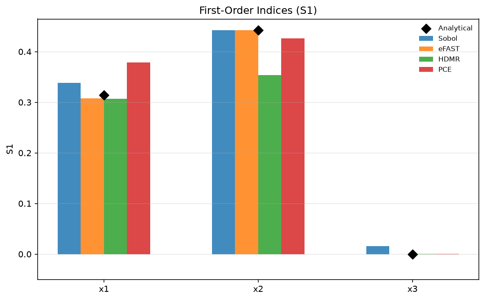
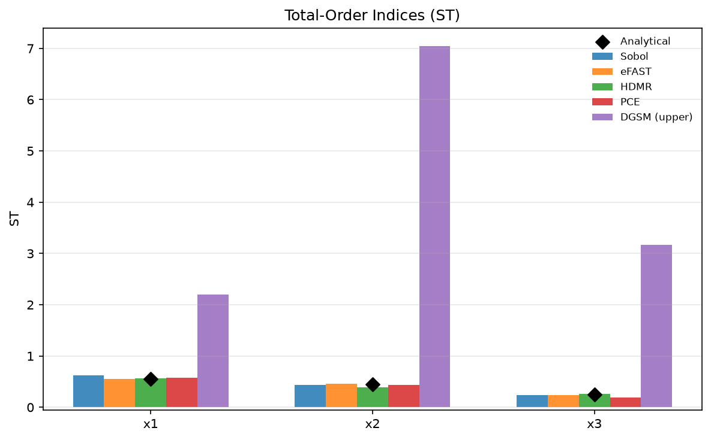
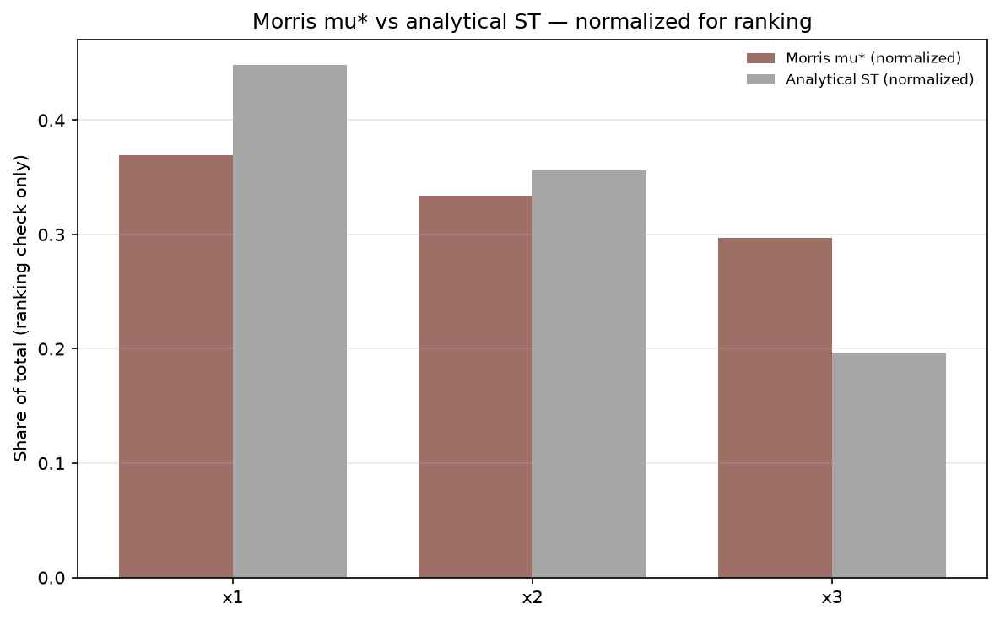
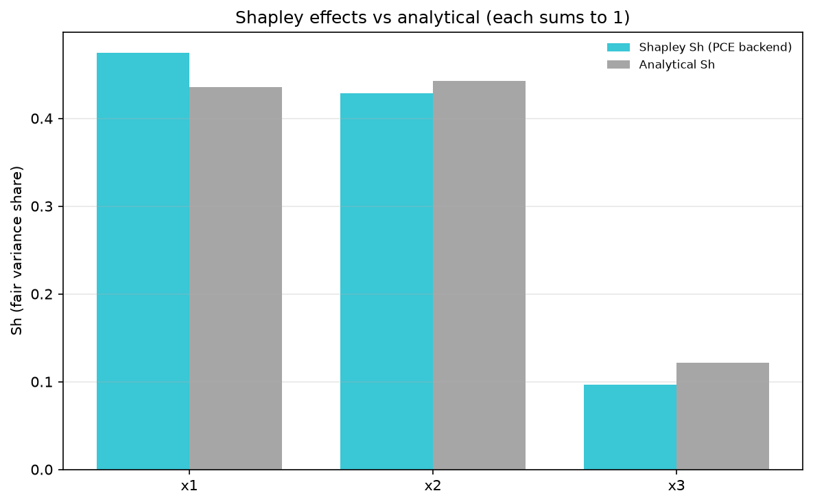
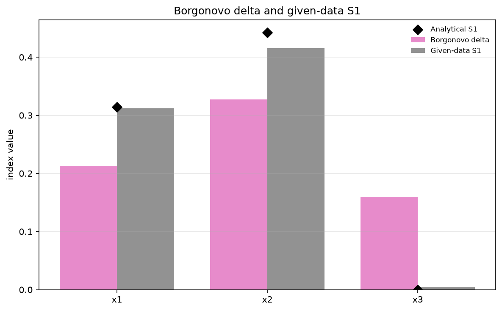
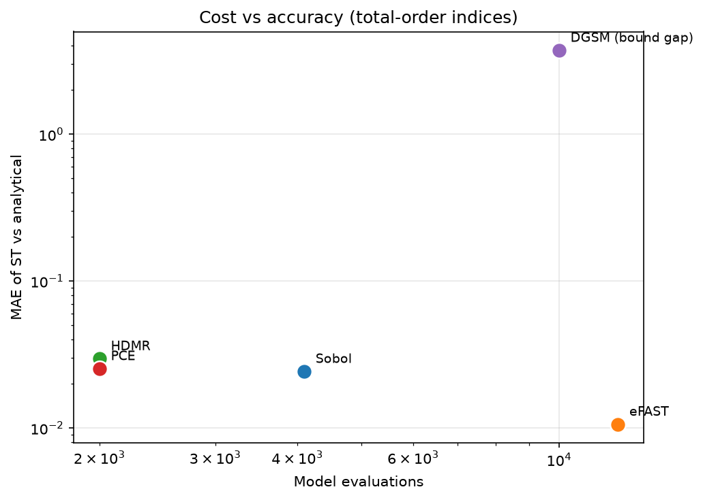

# Comparing eight methods on Ishigami

This page compares eight jaxgsa methods on one model — the Ishigami function — along accuracy, cost (model evaluations), and wall time, to support method choice.

The full script is [`examples/method_comparison.py`](https://github.com/danielepessina/jaxgsa/blob/master/examples/method_comparison.py), run with `uv run python examples/method_comparison.py`.

Every number below is printed by that script as it runs. The wall times come from one run on one machine and depend on hardware and JAX compile state, so read them as an order of magnitude, not as a benchmark.

## What is compared

Each method estimates first-order ($S_1$) and total-order ($S_T$) indices, and accuracy is the mean absolute error (MAE) of those estimates against Ishigami's analytical indices:

- $S_1 = [0.3139,\ 0.4424,\ 0.0000]$
- $S_T = [0.5576,\ 0.4424,\ 0.2437]$

Three rows of the results table need a different reading.

- **DGSM contributes its Poincaré upper-bound gap instead of $S_T$.** DGSM has no point estimate for the total index, only bounds, so its ST row is the MAE of the upper bound against the analytical $S_T$.
- **Morris is on its own scale.** $\mu^*$ is a mean absolute slope, not a variance share, so the Morris row is a ranking check only and carries no MAE columns.
- **Shapley and Borgonovo $S_1$ come from their given-data estimators.** Shapley reads $S_1$ out of the same PCE surrogate used for the PCE row (same 2,000 samples and order 4, which is why the two rows match exactly). Borgonovo reports $S_1$ from its built-in density estimator.

## Methodology

Timing note, verbatim from the script's printed output:

> Timing note: Sobol, eFAST, and Morris times are end-to-end (sample + evaluate + analyze). HDMR, PCE, Shapley, and Borgonovo times are analyze-only (shared pre-computed samples). DGSM time is analyze-only (internally evaluates via autodiff).

## Results

| Method | S1 MAE | ST MAE | N evals | Wall time (s) |
| --- | ---: | ---: | ---: | ---: |
| Sobol | 0.0136 | 0.0243 | 4,096 | 1.14 |
| eFAST | 0.0021 | 0.0106 | 12,288 | 0.37 |
| HDMR | 0.0320 | 0.0296 | 2,000 | 2.14 |
| PCE | 0.0271 | 0.0254 | 2,000 | 1.46 |
| DGSM (bound gap) | — | 3.7270 | 10,000 | 0.71 |
| Morris (screening) | — | — | 64 | 0.56 |
| Shapley (Sh) | 0.0271 | 0.0254 | 2,000 | 0.23 |
| Borgonovo delta | 0.0109 | — | 2,000 | 0.48 |

A "—" means the method does not produce that quantity: DGSM has no $S_T$ point estimate, Morris has no variance-share indices at all, and Borgonovo reports no $S_T$.

Four readings decide most method choices.

- **eFAST is the most accurate first-order method on this budget.** Its $S_1$ MAE is 0.0021, about six times smaller than Sobol's 0.0136, at three times the evaluations (12,288 vs 4,096).
- **Sobol is the reference for second order.** It is the only method here that reports $S_2$, and its $S_T$ MAE of 0.0243 is close behind eFAST's 0.0106 at a third of the evaluations. If you need pairwise interactions, this is the row to build on.
- **DGSM's bound gap is huge on Ishigami, and that is expected.** The 3.7270 gap means the Poincaré upper bound misses the true $S_T$ by nearly four. Ishigami's response is strongly non-monotone — $x_1$ enters linearly and again inside $x_3^4 \sin(x_1)$ — which is exactly the curved regime where the bound is loose. The script warns that the smallest upper bound is 2.20, above the maximum possible $S_T$ of 1, and that more samples will not tighten it. Use DGSM here to screen, not to estimate $S_T$.
- **Morris costs 64 evaluations.** That is the whole point: a screening check at a fraction of any other row's budget, in exchange for a ranking instead of indices.

## When to use each method

| Method | Best for |
| --- | --- |
| [Sobol'](/guide/methods#sobol-indices-via-saltelli-sampling) | Gold standard for $S_2$ |
| [eFAST](/guide/methods#efast-extended-fourier-amplitude-sensitivity-test) | Screening at $N \times D$ |
| [DGSM](/guide/methods#dgsm-derivative-based-global-sensitivity-measures) | Differentiable models via autodiff |
| [HDMR](/guide/methods#rs-hdmr-random-sampling-high-dimensional-model-representation) | Arbitrary $(X, Y)$ data |
| [PCE](/guide/methods#pce-polynomial-chaos-expansion) | Emulation with a reusable surrogate |
| [Morris](/guide/methods#morris-elementary-effects-screening) | Cheapest screening / factor fixing |
| [Shapley](/guide/methods#shapley-effects) | Fair variance shares summing to 1 |
| [Borgonovo delta](/guide/methods#borgonovo-delta-density-based-sensitivity) | Moment-independent influence on the whole output density |

HSIC and PAWN are given-data methods that sit outside this variance-share comparison: they measure dependence and distributional distance rather than variance shares, and they are the better choice when the output is skewed or heavy-tailed. For the estimator details behind every row, see [Methods](/guide/methods).

## Figures

The script draws six figures; the four index charts are grouped bars against the analytical values (black diamonds), Morris is a normalized ranking check, and the last chart is the cost-vs-accuracy trade-off.

