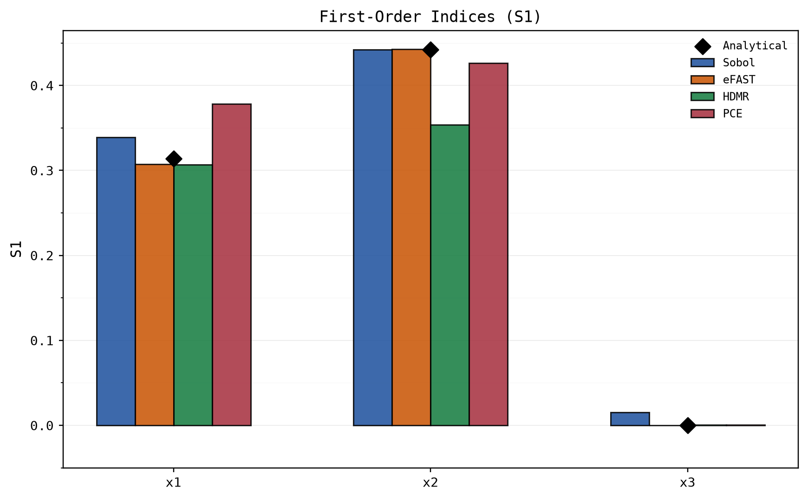
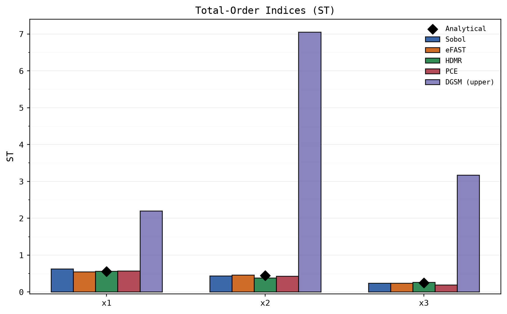
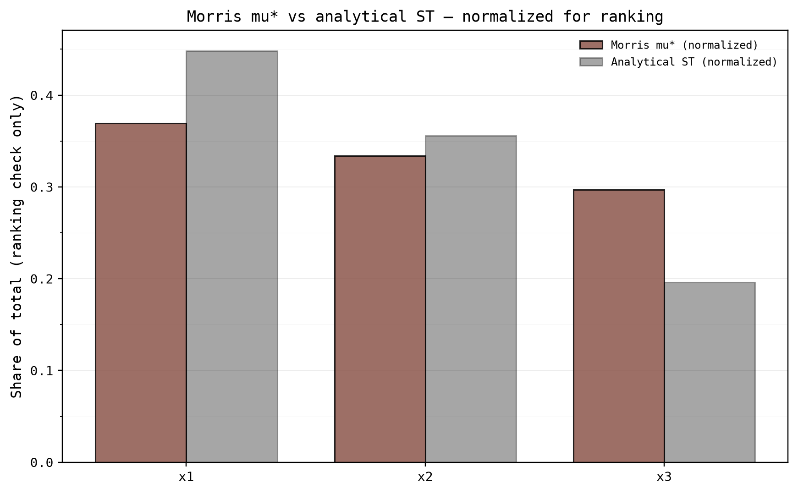
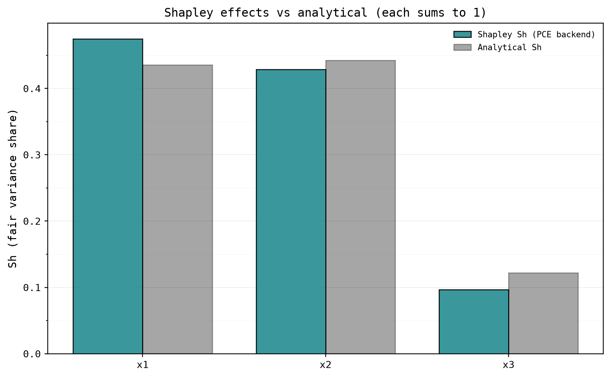
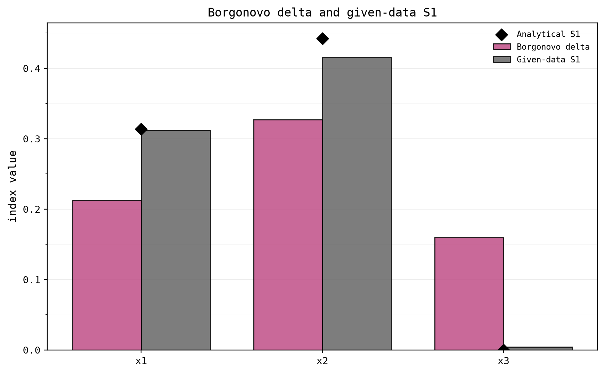
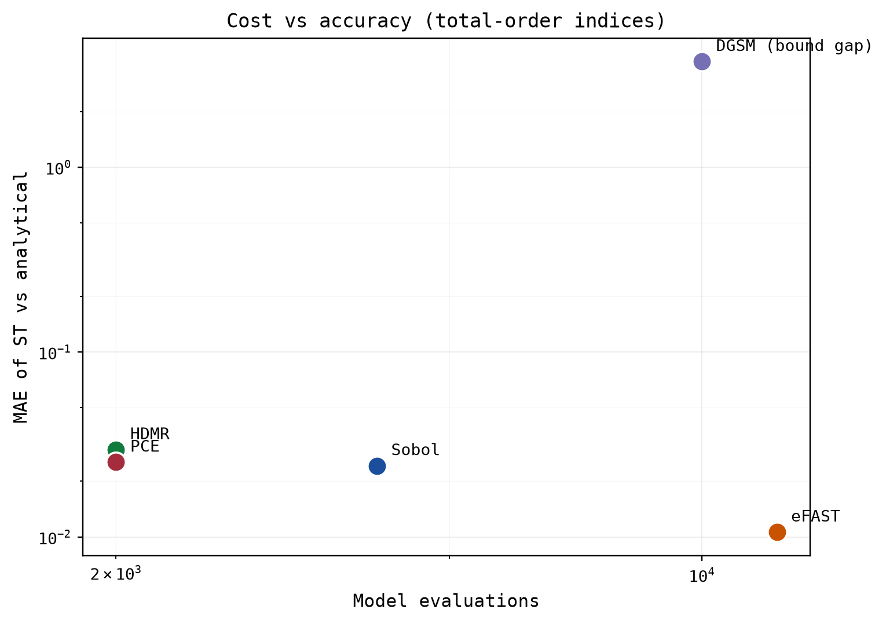

# Comparing Methods on Ishigami

Different sensitivity methods answer different questions. This example runs
eight methods on the same three-input model so you can see what each result
means, then compare model evaluations and accuracy where the quantities are
comparable.

The Ishigami function has a useful surprise: its third input has almost no
effect on its own, but matters through an interaction with the first input.
Its analytical first-order indices are $S_1 = [0.3139, 0.4424, 0.0000]$;
its total-order indices, which include interactions, are
$S_T = [0.5576, 0.4424, 0.2437]$. Looking only at the third input's
first-order index would miss its contribution.

The full script is [`examples/method_comparison.py`](https://github.com/danielepessina/jaxgsa/blob/master/examples/method_comparison.py), run with `uv run examples/method_comparison.py`.

The script prints the numbers below. Its wall times come from one machine and
depend on hardware and JAX compilation. Use them only as a rough indication
of cost.

## Start with the question

| Question | Methods in this example | What to read |
| --- | --- | --- |
| Which inputs explain output variation, alone and with interactions? | Sobol, eFAST, HDMR, PCE | `S1` and `ST` |
| Which inputs can I rule out cheaply? | Morris, DGSM | Screening measure or bound, not a variance share |
| How should variation be shared among inputs, including interactions? | Shapley | Shapley effects |
| Which inputs change the whole output distribution? | Borgonovo delta | Delta measure |

Start with [Sobol](/api/sobol) if you need both first and total effects and
possibly pairwise interactions. Try [Morris](/api/morris) if you need to narrow
many inputs before paying for a more detailed analysis. If you already have
input and output samples, methods such as [HDMR](/api/hdmr) and
[PCE](/api/pce) can use them directly. The [method guide](/guide/methods)
covers the remaining choices and assumptions.

## What the comparison shows

For methods that estimate `S1` or `ST`, the table reports mean absolute error
(MAE) against the analytical values above. Smaller is closer for this run.
`N evals` counts model evaluations. A dash means that the method does not
produce a comparable estimate.

| Method | S1 MAE | ST MAE | N evals | Wall time (s) |
| --- | ---: | ---: | ---: | ---: |
| Sobol | 0.0136 | 0.0243 | 4,096 | 1.14 |
| eFAST | 0.0021 | 0.0106 | 12,288 | 0.37 |
| HDMR | 0.0320 | 0.0296 | 2,000 | 2.14 |
| PCE | 0.0271 | 0.0254 | 2,000 | 1.46 |
| DGSM (bound gap) | — | 3.7270 | 10,000 | 0.71 |
| Morris (screening) | — | — | 64 | 0.56 |
| Shapley (Sh) | 0.0271 | 0.0254 | 2,000 | 0.23 |
| Borgonovo delta | 0.0109 | — | 2,000 | 0.48 |

For this model and these sample sizes, eFAST's first-order estimates are closer
to the analytical values than Sobol's, but use three times as many model
evaluations. Sobol also gives pairwise interaction indices when its
second-order option is enabled. Morris gives a screening ranking with only 64
evaluations; it does not estimate a share of output variance.

The DGSM row needs special care: 3.7270 is the error of its *upper bound* for
`ST`, not an index estimate. The bound is loose for this non-monotone model,
so use DGSM here to screen inputs rather than to estimate their total effects.
Shapley and Borgonovo report `S1` through their given-data estimators; the
Shapley run uses the same PCE surrogate as the PCE row, explaining their
matching `S1` values.

The time columns also cover different work. Sobol, eFAST, and Morris include
sampling, model evaluation, and analysis. HDMR, PCE, Shapley, and Borgonovo
time analysis of shared precomputed samples. DGSM times analysis that evaluates
the model internally with automatic differentiation. Do not compare the wall
times as if all rows included the same steps.

HSIC and PAWN are given-data methods outside this comparison. They measure
dependence or changes in the output distribution. See [Choosing a method](/guide/methods)
for the full method comparison and assumptions behind each choice.

## Figures

The script draws six figures; the four index charts are grouped bars against the analytical values (black diamonds), Morris is a normalized ranking check, and the last chart is the cost-vs-accuracy trade-off.

