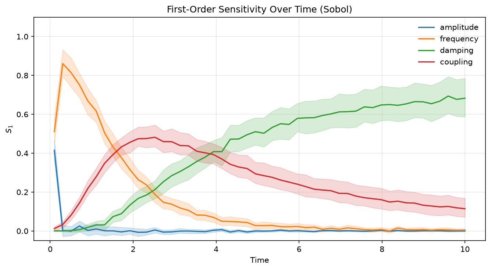
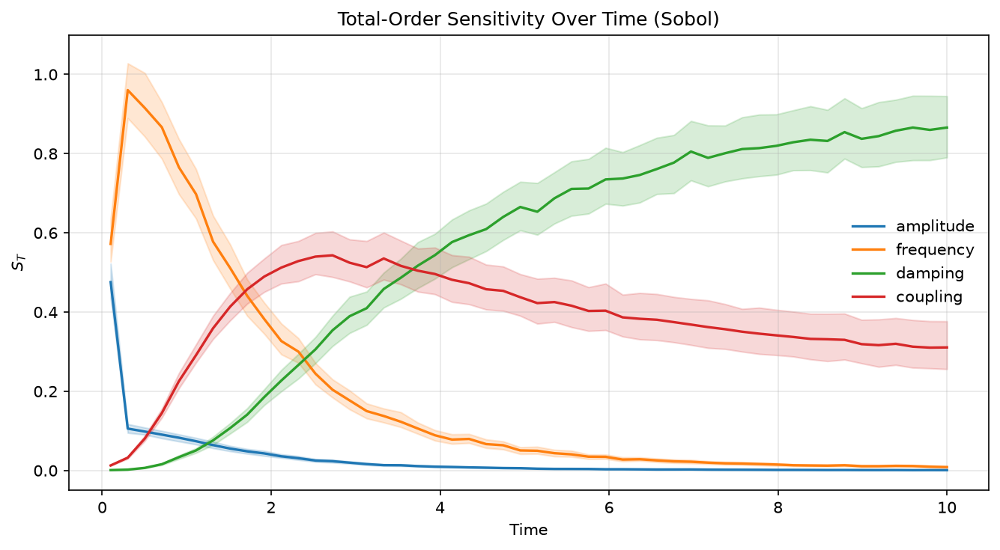
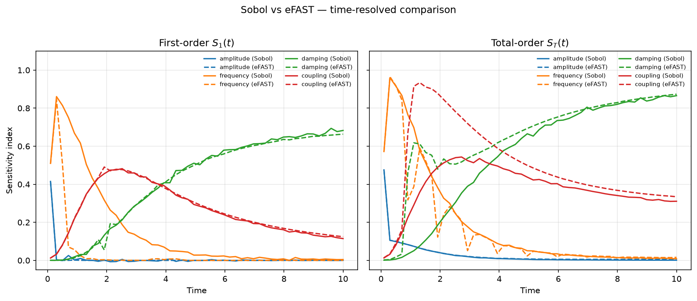
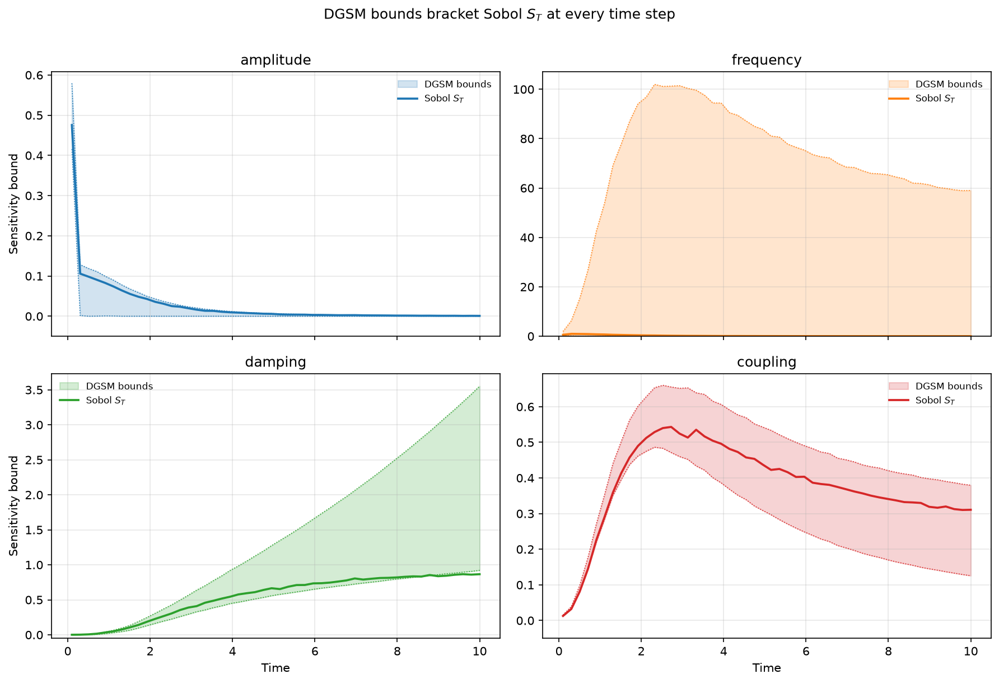

# Multi-Output & Time-Series

`jaxgsa` reads the meaning of your output array from its rank alone. It does not
guess, and it does not transpose. `(N,)` is a scalar output, `(N, K)` is `K`
outputs at one instant, and `(N, T, K)` is `K` outputs over `T` timepoints. `N`
is the number of model runs and `D` is the number of input parameters.

Two axes of the same length are where this bites, and a time axis and an output
axis are both just integers. The last two sections give the full table of what
is accepted, what raises, and the one case that is accepted and means something
other than you intended.

The full script is [`examples/dynamic_gsa.py`](https://github.com/danielepessina/jaxgsa/blob/master/examples/dynamic_gsa.py), run with `uv run python examples/dynamic_gsa.py`.

## One model, two layouts

A damped oscillator with four inputs, returning displacement and velocity at 40
timepoints. Displacement carries an additive `offset` term; velocity does not.
That asymmetry is the check later on.

```python
import jax.numpy as jnp
import numpy as np
import jaxgsa

problem = jaxgsa.Problem.from_dict(
    {
        "amplitude": (0.5, 2.0),
        "frequency": (1.0, 5.0),
        "damping": (0.01, 0.5),
        "offset": (-1.0, 1.0),
    },
    output_names=("displacement", "velocity"),
)

time_values = np.linspace(0.0, 5.0, 40)


def oscillator(X):
    amp = X[:, 0, None]
    freq = X[:, 1, None]
    damping = X[:, 2, None]
    offset = X[:, 3, None]
    tt = jnp.asarray(time_values)[None, :]

    displacement = amp * jnp.sin(2 * jnp.pi * freq * tt) * jnp.exp(-damping * tt) + offset
    velocity = amp * jnp.cos(2 * jnp.pi * freq * tt) * jnp.exp(-damping * tt)

    return jnp.stack([displacement, velocity], axis=-1)  # (N, T, K)


design = jaxgsa.sobol.sample(problem, n_samples=2048, seed=42)
X = jnp.asarray(design.samples)

Y_time = oscillator(X)         # (N, T, K) = (2560, 40, 2)
Y_snapshot = Y_time[:, -1, :]  # (N, K)    = (2560, 2)

time_result = jaxgsa.sobol.analyze(design, Y_time)
snapshot_result = jaxgsa.sobol.analyze(design, Y_snapshot)
```

`jnp.stack(..., axis=-1)` is the line that makes the layout work. Stack outputs
on the last axis and you get `(N, T, K)` for free. Stack them anywhere else and
you will spend the rest of this page fighting the shape rules.

```text
jaxgsa.sobol.sample: D=4, mode=second-order, base_n=256, requested_runs>=2048, n_runs=2560, n_expanded=2560, duplicates_removed=0 (0.0%), scramble=True
jaxgsa.sobol.analyze
  problem: D=4 (amplitude, frequency, damping, offset)
    marginals: uniform=4
    correlation: independent
    output: N=2560 runs, T=40 x K=2 output slices
    invalid: none found in 256 Saltelli groups (policy 'raise')
  timing:
    estimators (includes compile on the first call): 0.4486 s
    slice_chunk_size: 80 (resolved from the memory budget)
    estimator: saltelli-jansen
  results: top 4 of 4 parameters by ST, mean over 80 output slices
    1. frequency  ST=0.7365
    2. offset     ST=0.2497
    3. amplitude  ST=0.09106
    4. damping    ST=0.08931
```

`T=40 x K=2 output slices` is the line that confirms `jaxgsa` read your array
the way you meant it. Check it before you read any index. The ranking underneath
is a mean over all 80 slices, which is a summary and nothing more. A parameter
that dominates for the first ten timepoints and vanishes afterwards averages
down to nothing here.

The second call prints `T=1 x K=2 output slices` for the same reason, and it
resolves `slice_chunk_size` to 2 instead of 80, because there are only 2 slices
left to work on.

## What comes back

```python
np.set_printoptions(precision=3, suppress=True)

print("time S1    ", time_result.S1.shape)
print("snapshot S1", snapshot_result.S1.shape)
print("displacement @ last t:", np.asarray(time_result.S1[-1, 0, :]))
print("velocity     @ last t:", np.asarray(time_result.S1[-1, 1, :]))
print("snapshot displacement:", np.asarray(snapshot_result.S1[0, :]))
print("snapshot velocity    :", np.asarray(snapshot_result.S1[1, :]))
```

```text
time S1     (40, 2, 4)
snapshot S1 (2, 4)
displacement @ last t: [-0.003  0.161 -0.018  0.663]
velocity     @ last t: [ 0.021  0.689 -0.07   0.   ]
snapshot displacement: [-0.003  0.161 -0.018  0.663]
snapshot velocity    : [ 0.021  0.689 -0.07   0.   ]
```

The index array mirrors the output array with `N` replaced by `D` and moved to
the end. `(N, T, K)` in gives `(T, K, D)` out, 320 numbers. `(N, K)` in gives
`(K, D)` out. The parameter order inside the last axis is the declaration order
from `from_dict()`, so amplitude, frequency, damping, offset.

The snapshot rows are identical to the last-timepoint rows, to every digit
printed. They are the same data reaching the same estimator by two routes. If
you ever slice a time result and get something different from analysing the
slice directly, the layout was misread somewhere.

Now read the numbers. For velocity, `offset` scores exactly 0.000. That is
structural rather than a small estimate. Velocity has no `offset` term, so the
estimator recovers a hard zero. Use a known-absent input this way whenever you
can. It is the cheapest possible check that your outputs are lined up with your
design.

For displacement, `offset` is the largest contributor at 0.663 and `frequency`
is second at 0.161. At `t = 0` the split is very different:

```python
print("displacement S1 for offset,    t = 0 / 2.56 / 5:", np.asarray(time_result.S1[[0, 20, 39], 0, 3]))
print("displacement S1 for amplitude, t = 0 / 2.56 / 5:", np.asarray(time_result.S1[[0, 20, 39], 0, 0]))
```

```text
displacement S1 for offset,    t = 0 / 2.56 / 5: [0.953 0.499 0.663]
displacement S1 for amplitude, t = 0 / 2.56 / 5: [0.   0.008 -0.003]
```

At `t = 0` the sine is zero, so displacement is the offset and nothing else, and
`S1` says 0.953. By the middle of the window the oscillation has taken half the
variance. This is the reason to keep the time axis rather than analyse a
summary statistic. A single number for the whole trajectory would have reported
one blend of these and hidden the fact that the driver changes.

`amplitude` scores near zero throughout, and at the last timepoint it is
negative, -0.003. A negative Sobol index is impossible, so that is the noise
floor. Amplitude only enters multiplied by a sine whose sign flips fast across
the frequency range, so its main effect averages out. Its `ST` is 0.036, which
is small but real.

## When 256 base points is not enough

The verbose block reported `base_n=256`, because a second-order design at `D=4`
spends 10 rows per base point. Look at what that does to the total-order index:

```python
print("ST velocity @ last t:", np.asarray(time_result.ST[-1, 1, :]))
```

```text
ST velocity @ last t: [0.103 1.158 0.349 0.   ]
```

`frequency` has `ST = 1.158`. A total-order index is a variance share and cannot
exceed 1. Rerunning at `n_samples=65536`, so `base_n=8192`, brings it to 0.983.
Nothing was fixed. The estimator was simply averaging 256 samples of a quantity
that swings hard, because at `t = 5` a frequency anywhere in `[1, 5]` puts the
cosine anywhere in `[-1, 1]`.

Two things follow. An index above 1 or below 0 is a sample-size warning, and it
is the only free one you get without bootstrapping. And a wildly oscillating
output needs far more samples than a smooth one for the same accuracy, so pick
`n_samples` from the roughness of your output, not from `D`. Confidence
intervals from
[Bootstrap Confidence Intervals](/examples/bootstrap) give you the same warning
for every index rather than only for the ones that overshoot.

## Compare three methods across time

This section overlays Sobol, eFAST, and DGSM on one time-resolved model: a
coupled damped oscillator

$$
y(t) = A \sin(2\pi\omega t)\, e^{-\gamma t} + \kappa\, t\, e^{-\gamma t}
$$

with four uniform inputs — amplitude $A \in [0.5, 2.0]$, frequency $\omega
\in [1.0, 5.0]$, damping $\gamma \in [0.01, 0.5]$, coupling $\kappa \in [0.1,
2.0]$ — evaluated at $T = 50$ steps over $t \in [0.1, 10.0]$. The whole
workflow, three estimators on the same model:

```python
import jax
import jax.numpy as jnp
import jaxgsa

problem = jaxgsa.Problem.from_dict(
    {
        "amplitude": (0.5, 2.0),
        "frequency": (1.0, 5.0),
        "damping": (0.01, 0.5),
        "coupling": (0.1, 2.0),
    },
)
T = 50
times = jnp.linspace(0.1, 10.0, T)


def oscillator(X):
    """Batched: (N, D) -> (N, T)."""
    amp, freq, damping, coupling = X[:, 0:1], X[:, 1:2], X[:, 2:3], X[:, 3:4]
    t = times[None, :]
    return amp * jnp.sin(2 * jnp.pi * freq * t) * jnp.exp(-damping * t) + coupling * t * jnp.exp(
        -damping * t
    )


# 1. Sobol (Saltelli), first/total-order only
sampling_result = jaxgsa.sobol.sample(problem, n_samples=4096, seed=0, calc_second_order=False)
Y_sobol = oscillator(jnp.asarray(sampling_result.samples))[..., None]  # (N, T) -> (N, T, 1)
sobol_result = jaxgsa.sobol.analyze(
    sampling_result,
    Y_sobol,
    n_bootstrap=200,
    conf_level=0.95,
    ci_method="quantile",
    key=jax.random.key(0),
)

# 2. eFAST on the same model
efast_samples = jaxgsa.efast.sample(problem, n_per_curve=4096, M=4, seed=42)
Y_ef = oscillator(jnp.asarray(efast_samples.samples))[..., None]
efast_result = jaxgsa.efast.analyze(efast_samples, Y_ef)

# 3. DGSM on the unbatched function
def oscillator_unbatched(x):
    """Unbatched: (D,) -> (T,)."""
    amp, freq, damping, coupling = x
    t = times
    return amp * jnp.sin(2 * jnp.pi * freq * t) * jnp.exp(-damping * t) + coupling * t * jnp.exp(
        -damping * t
    )


X_dgsm = jaxgsa.sampling.monte_carlo(problem, n=50_000, seed=7)
dgsm_result = jaxgsa.dgsm.analyze(problem, oscillator_unbatched, jnp.asarray(X_dgsm))
```

`calc_second_order=False` keeps the Saltelli design at $(D+2) \times
\text{base\_n} = 6 \times 1024 = 6144$ runs instead of the 10240 a
second-order design would cost, and the trajectory already multiplies the
output 50-fold. The `[..., None]` reshape turns the `(N, T)` output into
`(N, T, 1)` so the axis is read as time; without it the 50 steps would be
read as 50 separate outputs at one instant. The bootstrap adds a 95%
quantile interval per index from 200 replicates.

DGSM is the odd one out, and the verbose block says why: with a bare
`(D,) -> (T,)` function, `analyze` counts every time step as an independent
output — the report reads `T=1 x K=50 output slices` — and returns bounds of
shape `(50, 4)`, i.e. `(T, D)`, with `gradients: forward-mode autodiff
(T*K=50, D=4)`.

**Three phases.** The Sobol $S_T$ curves split the trajectory into three
phases. Numbers are $S_T$ in parameter order amplitude, frequency, damping,
coupling unless stated.

- **Early, $t \lesssim 2$: the oscillatory term carries the variance.** At
  $t = 0.1$, $S_T = [0.476, 0.572, 0.001, 0.013]$: amplitude and frequency
  share it through $A \sin(2\pi\omega t)$, while damping and coupling are
  negligible because $e^{-\gamma t} \approx 1$. Frequency carries the
  largest mean $S_1$ in the window (0.585 over $t < 2$; 0.669 at $t = 0.91$),
  coupling's linear $\kappa t$ term climbs ($S_1$ from 0.012 at $t = 0.1$ to
  0.393 at $t = 1.5$), and amplitude's main effect washes out once the sine
  averages over $\omega$ ($S_1$ from 0.415 at $t = 0.1$ to 0.003 at $t =
  0.91$).
- **Mid, $2 \lesssim t \lesssim 5$: coupling and damping overtake
  frequency.** At $t = 3.5$, $S_1 = [-0.002, 0.082, 0.357, 0.410]$ — the
  envelope decay and the $\kappa t e^{-\gamma t}$ term now shape the
  variance.
- **Late, $t > 5$: damping takes over.** $S_1$ runs 0.62-0.68 and $S_T$
  0.79-0.87; at $t = 10.0$, $S_T = [0.001, 0.009, 0.866, 0.311]$.

A steady-state analysis at a single late time captures only the last phase:
at $t = 10.0$ it would report damping 0.866 and coupling 0.311 with
frequency and amplitude at the noise floor, and the early story — frequency's
lead, coupling's climb — invisible.





**Cross-method agreement.** The mean-over-time reports agree on the broad
ranking: damping first, amplitude last, with coupling and frequency second
and third (Sobol $S_T$ 0.5501 / 0.3793 / 0.1884 / 0.0286; eFAST $S_T$
0.6477 / 0.5004 / 0.1627 / 0.0310). DGSM's $\nu$ means put frequency second
(313.8 / 152.2 / 4.386 / 0.1366): $\partial y / \partial \omega$ carries a
factor $t$, so the squared-derivative measure weights the fast term more
heavily than its variance share.

Solid Sobol lines and dashed eFAST lines agree where the output is smooth:
amplitude everywhere, and the late phase (mean $S_T$ over $t > 5$: damping
0.794 vs 0.808, coupling 0.358 vs 0.390). They diverge in the early
transient, where the output oscillates fastest: at $t = 0.91$ Sobol gives
frequency $S_T$ 0.765 where eFAST gives 0.318, and eFAST's $S_T$ for damping
and coupling runs far above Sobol's (0.462 vs 0.034, 0.67 vs 0.226). The
fast oscillation spreads the frequency input's power across Fourier
harmonics, so eFAST's $S_1$ for frequency reads 0.057 against Sobol's 0.669
at that step.



The DGSM bracket tracks the Sobol $S_T$ curve through the trajectory and
contains all four point estimates at 42 of the 50 steps. The exceptions are
the uniform-marginal warning doing its job: the script warns that the
Kucherenko-Song lower bound is an estimate, not a strict bound, for uniform
marginals, and the misses are lower estimates sitting above the $S_T$ point
estimate — coupling by $3 \times 10^{-5}$ at $t = 0.1$, and damping by 0.3-6%
for $t \geq 8.6$ (0.835 vs 0.832 at $t = 8.6$; 0.921 vs 0.866 at $t = 10.0$).
So the bracket is a sanity check, not a proof: it hugs the Sobol curve
everywhere and contains it almost everywhere, and the misses are exactly the
failure mode the warning names.



## The full shape table

Every row below was run against a design built from a 4-parameter problem, with
`N = 2560` and 40 timepoints.

| `Y` shape | `problem.output_names` | Result |
| --- | --- | --- |
| `(2560,)` | none, or 1 name | `S1` is `(4,)` |
| `(2560,)` | 2 names | `ValueError: output_names length 2 does not match the output axis K=1` |
| `(2560, 2)` | 2 names | `S1` is `(2, 4)` |
| `(2560, 40, 2)` | 2 names | `S1` is `(40, 2, 4)` |
| `(2560, 40, 1)` | 1 name | `S1` is `(40, 1, 4)` |
| `(2560, 40)` | 1 name | `ValueError: output_names length 1 does not match the output axis K=40` |
| `(2560, 40)` | none | `S1` is `(40, 4)`, and the 40 are read as outputs |
| `(2, 2560)` | 2 names | `ValueError: Y has 2 sample rows but 2560 were expected` |
| `(2560, 40, 2, 1)` | 2 names | `ValueError: Y must be 1-D (N,), 2-D (N, K), or 3-D (N, T, K)` |

Four rules cover the table.

The sample axis is always first. A transposed array is caught by the row count,
not by an axis-shape heuristic, and there is no warning and no repair. If your
model returns `(K, N)`, transpose it yourself.

Rank fixes the meaning. A 2D array is `(N, K)`, always. There is no case in
which `jaxgsa` reads a 2D array as `(N, T)`.

`output_names` is a hard check, not a label. Its length must equal the size of
the last axis, and 1 for a 1D array. Set it and it catches the mistakes in rows
2 and 6 before any compute happens. This is the strongest reason to name your
outputs even when you never plan to export a dataset.

Rank above 3 raises immediately.

## The one silent case

Row 7 is the one to watch. Pass `(N, T)` with no `output_names` and it is
accepted as `T` separate outputs at a single instant.

The index values are unharmed. Sobol treats every slice independently, so
`analyze(d0, Y_2d).S1` matches `analyze(d1, Y_2d[:, :, None]).S1[:, 0, :]`
exactly, to a max difference of 0.0. What breaks is everything downstream of the
labels:

```python
params = {
    "amplitude": (0.5, 2.0),
    "frequency": (1.0, 5.0),
    "damping": (0.01, 0.5),
    "offset": (-1.0, 1.0),
}
unnamed = jaxgsa.Problem.from_dict(params)
named = jaxgsa.Problem.from_dict(params, output_names=("displacement",))

d0 = jaxgsa.sobol.sample(unnamed, n_samples=2048, seed=42, verbose=False)
d1 = jaxgsa.sobol.sample(named, n_samples=2048, seed=42, verbose=False)
Y_2d = Y_time[:, :, 0]  # (2560, 40): displacement over time

ds_wrong = jaxgsa.sobol.analyze(d0, Y_2d, verbose=False).to_dataset()
ds_right = jaxgsa.sobol.analyze(d1, Y_2d[:, :, None], verbose=False).to_dataset(
    time_coords=time_values
)

print(list(ds_wrong.dims))
print(list(ds_right.dims))
```

```text
['output', 'param', 'param_i', 'param_j']
['time', 'output', 'param', 'param_i', 'param_j']
```

The wrong dataset has no time dimension and labels the 40 timepoints `y0`
through `y39`. You cannot select by time, you cannot plot against `time_values`,
and a colleague reading the netCDF file has no way to know that `y17` is a
moment rather than a quantity.

Add the trailing axis with `Y[:, :, None]` and name the single output. Two
characters and one keyword, and the labels come out right.

## Practical caveats

- `problem.output_names` drives the `output` coordinate on export, so set it at
  problem-declaration time rather than patching the dataset afterwards.
- `calc_second_order=False` drops `S2` and cuts the rows per base point from
  $2D+2$ to $D+2$. On a large `(T, K)` output that is the first knob to reach
  for, because `S2` is `(T, K, D, D)` and grows quadratically in `D`.
- The same shape rules hold for `jaxgsa.hdmr.analyze()` and every other
  `analyze()` in the package. They come from one shared validator.

## See also

- [xarray Labeled Output](/examples/xarray) for selecting these arrays by
  parameter, output and time name.
- [Bootstrap Confidence Intervals](/examples/bootstrap) for putting an interval
  on each of those 320 numbers.
- [RS-HDMR Example](/examples/hdmr) for the same shapes on the surrogate route.
- [Screen first, then quantify](/examples/advanced-workflow) for cutting 20 inputs to 4 with Morris,
  then spending the Sobol budget on the survivors.
