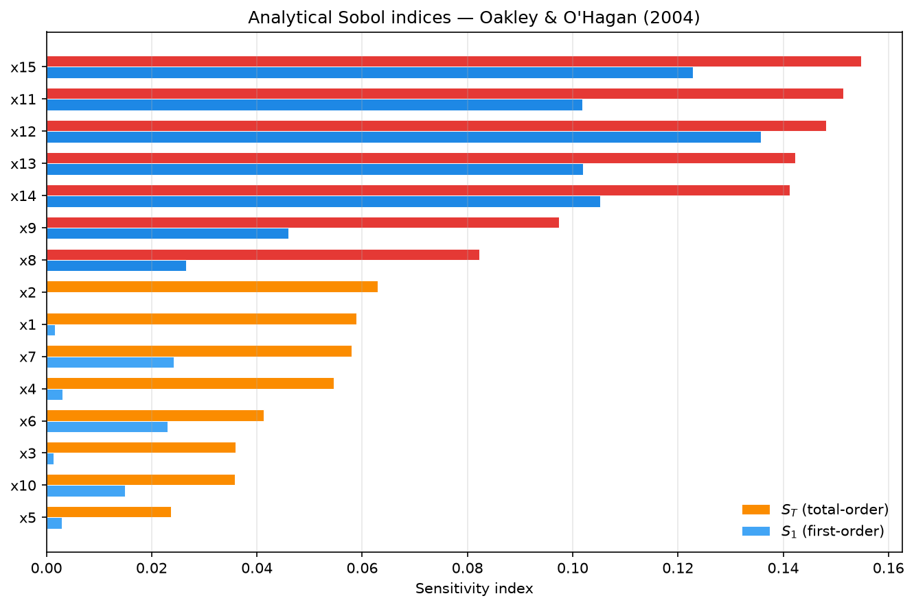
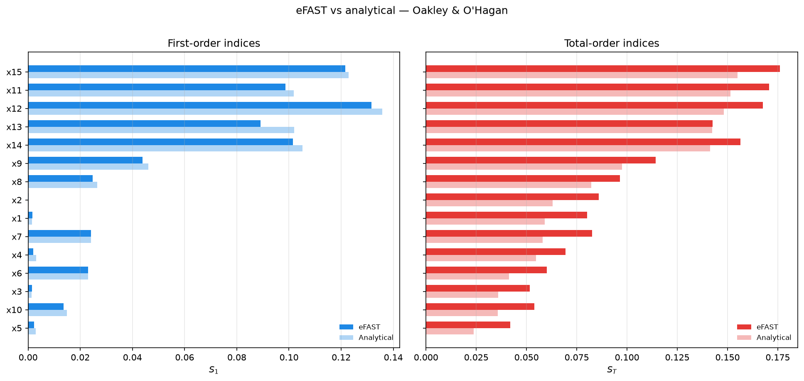
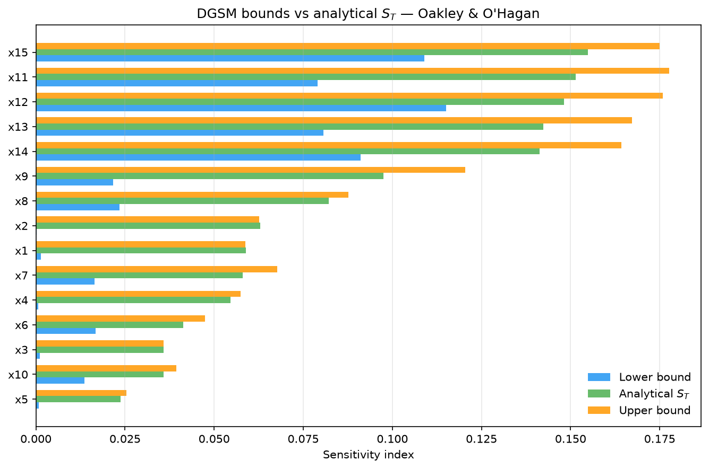
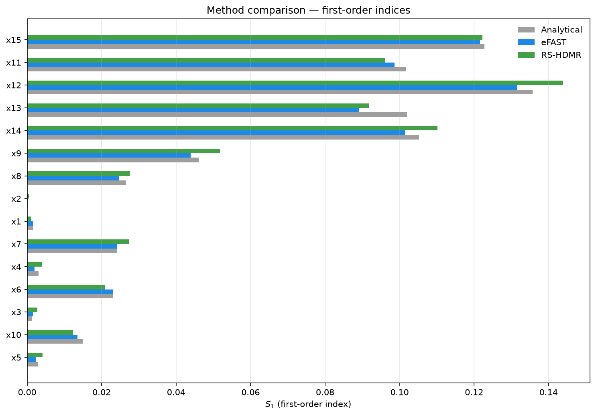

# Non-Uniform Inputs

A marginal is the distribution of one input on its own. Sobol indices are
defined against those marginals, so declaring the wrong one does not give you a
slightly noisier answer. It gives you the right answer to a question about a
system you do not have. The second half of this page shows one such mistake
reversing an importance ranking end to end.

`jaxgsa.Problem.from_dict(...)` takes the `(low, high)` uniform shorthand and
tagged specs for Gaussian and truncated Gaussian inputs. A truncated Gaussian
is a Gaussian restricted to an interval, with the remaining probability rescaled
to sum to one.

The full script is [`examples/oakley_ohagan_15d.py`](https://github.com/danielepessina/jaxgsa/blob/master/examples/oakley_ohagan_15d.py), run with `uv run python examples/oakley_ohagan_15d.py`.

## Declare a mixed problem

One input of each kind. The key becomes the parameter name, and `dist` marks the
entry as a distribution spec rather than a bounds pair.

```python
import jax.numpy as jnp
import numpy as np
from scipy.stats import truncnorm

import jaxgsa

problem = jaxgsa.Problem.from_dict(
    {
        "uniform": (0.0, 2.0),
        "gaussian": {"dist": "gaussian", "mean": 1.0, "variance": 2.25},
        "truncated": {
            "dist": "gaussian",
            "mean": 0.5,
            "variance": 1.44,
            "low": -3.1,
            "high": 4.1,
        },
    }
)
```

The truncation sits at 3 standard deviations either side of the mean, because
$0.5 \pm 3 \times 1.2$ is $[-3.1, 4.1]$. Hold on to that. It is the number the
last section abuses.

Rules for Gaussian specs:

- `mean` and `variance` describe the parent Gaussian, before truncation.
- `low` and `high` are optional and independent. Truncating one side only is
  fine.
- When either bound is present, `jaxgsa.sobol.sample()` uses a true truncated
  normal transform. It does not clip samples that fall outside.
- An unbounded Gaussian is still bounded in practice, at $\pm 7.0345$ standard
  deviations. Inverse-CDF sampling has to keep the unit coordinate off 0 and 1,
  and that clip is what the distance works out to.
- `Problem.from_dict(params, truncate_gaussians=q)` fills `low` and `high` into
  every Gaussian that does not already declare them, at that marginal's own `q`
  and `1 - q` quantiles. Sides you wrote yourself are left alone. Use it when
  one bounded input model has to be shared across methods.

## Check against a closed form

Use a linear model here, because its Sobol indices are known exactly. That turns
the run into a test of the sampler rather than a demonstration of it. For

$$
y = \sum_i a_i x_i
$$

the first-order and total-order indices are the same number,

$$
S_i = \frac{a_i^2 \operatorname{Var}(X_i)}{\sum_j a_j^2 \operatorname{Var}(X_j)}
$$

because a sum of separate terms has no interactions for `ST` to pick up.

```python
coeffs = jnp.array([1.5, -0.75, 0.7])

design = jaxgsa.sobol.sample(problem, n_samples=8192, calc_second_order=False, seed=101)
X = jnp.asarray(design.samples)
Y = X @ coeffs

result = jaxgsa.sobol.analyze(design, Y)
```

```text
jaxgsa.sobol.sample: D=3, mode=first/total-order, base_n=2048, requested_runs>=8192, n_runs=10240, n_expanded=10240, duplicates_removed=0 (0.0%), scramble=True
jaxgsa.sobol.analyze
  problem: D=3 (uniform, gaussian, truncated)
    marginals: uniform=1, gaussian=2
    correlation: independent
    output: N=10240 runs, T=1 x K=1 output slice
    invalid: none found in 2048 Saltelli groups (policy 'raise')
  timing:
    estimators (includes compile on the first call): 0.3932 s
    slice_chunk_size: 1 (resolved from the memory budget)
    estimator: saltelli-jansen
  results: top 3 of 3 parameters by ST
    1. gaussian   ST=0.4681
    2. uniform    ST=0.2777
    3. truncated  ST=0.2544
```

Read `marginals: uniform=1, gaussian=2` first. Two Gaussians, because a
truncated Gaussian is counted as a Gaussian. If that line says `uniform=3` you
have made the mistake this page is about, and you can catch it before the
analysis finishes.

The exact answer needs each input's variance. The uniform gives
$(\text{high}-\text{low})^2/12$, the Gaussian gives the declared 2.25, and
`scipy.stats.truncnorm` gives the truncated one. Its `a` and `b` arguments are
the bounds measured in standard deviations from the mean, which is not the same
convention as `low` and `high`.

```python
std = np.sqrt(1.44)
a, b = (-3.1 - 0.5) / std, (4.1 - 0.5) / std

variances = np.array([(2.0 - 0.0) ** 2 / 12.0, 2.25, truncnorm.var(a, b, loc=0.5, scale=std)])
weights = np.square(np.asarray(coeffs)) * variances
analytical = weights / weights.sum()

np.set_printoptions(precision=4, suppress=True)
print("S1        ", np.asarray(result.S1))
print("ST        ", np.asarray(result.ST))
print("analytical", analytical)
```

```text
S1         [0.2778 0.4679 0.2543]
ST         [0.2777 0.4681 0.2544]
analytical [0.2775 0.4683 0.2541]
```

Every entry agrees with the closed form to within 0.0004, and `S1` agrees with
`ST` to within 0.0002. Both facts are checks, not results. The first says the
truncated normal transform is drawing from the distribution you declared. The
second says the estimator found no interaction in a model that has none, so what
you are seeing is the noise floor at `base_n=2048`, and it is about $2 \times
10^{-4}$. Any interaction smaller than that in a real model would be invisible
here.

`result.S2` is `None`, because `calc_second_order=False` never built the design
rows it needs. The output was one number per run, so `result.S1` has shape
`(D,)`. See [Multi-Output & Time-Series](/examples/multi-output) for what
happens to that shape when the model returns more.

## Getting the marginal wrong flips the ranking

Here is the mistake, and it is a tempting one. You know `truncated` lives in
$[-3.1, 4.1]$. You do not have its distribution to hand. So you declare the
range as a uniform and move on.

```python
wrong = jaxgsa.Problem.from_dict(
    {
        "uniform": (0.0, 2.0),
        "gaussian": {"dist": "gaussian", "mean": 1.0, "variance": 2.25},
        "truncated": (-3.1, 4.1),
    }
)

design_w = jaxgsa.sobol.sample(wrong, n_samples=8192, calc_second_order=False, seed=101, verbose=False)
Xw = jnp.asarray(design_w.samples)
result_w = jaxgsa.sobol.analyze(design_w, Xw @ coeffs)
```

```text
jaxgsa.sobol.analyze
  problem: D=3 (uniform, gaussian, truncated)
    marginals: uniform=2, gaussian=1
    correlation: independent
    output: N=10240 runs, T=1 x K=1 output slice
    invalid: none found in 2048 Saltelli groups (policy 'raise')
  timing:
    estimators (includes compile on the first call): 0.0007109 s
    slice_chunk_size: 1 (resolved from the memory budget)
    estimator: saltelli-jansen
  results: top 3 of 3 parameters by ST
    1. truncated  ST=0.5124
    2. gaussian   ST=0.306
    3. uniform    ST=0.1815
```

The timing line dropped from 0.3932 s to 0.0007 s, because the shapes are the
same and XLA reuses the compiled kernels from the first analysis. Timings in a
verbose block only mean something on the first call of a given shape.

`truncated` went from last at 0.2544 to first at 0.5124, and every other input
moved down a place. The whole ranking reversed. Nothing about the model changed.
The bounds are identical. Only the shape inside them changed.

The arithmetic is one line. The sampled variance of that column is 1.4014 under
the truncated Gaussian and 4.32 under the uniform, because a uniform on a
$6\sigma$ window has variance $(6\sigma)^2/12 = 3\sigma^2$. A first-order Sobol
index for a linear model is proportional to input variance, so tripling the
variance roughly triples the index. Check it yourself with
`np.var(np.asarray(X), axis=0)` against `np.var(np.asarray(Xw), axis=0)`.

Nothing in either run looks wrong. Both agree with their own closed form. Both
report clean diagnostics. The `wrong` result is a correct sensitivity analysis
of a system whose third input is uniform, and you do not have that system. This
is why the failure is worth a section. It is silent, and the only place it shows
is the one-line `marginals:` count in the verbose block.

The direction of the error is predictable. Substituting a uniform for a
bell-shaped marginal on the same support always inflates the variance, so it
always overstates that input. The factor is $3$ at $\pm 3\sigma$ and grows with
the width of the window. A range you are confident about, combined with a shape
you guessed, is the worst of both.

## High-dimensional: Oakley & O'Hagan (15 inputs)

This section puts three methods on the 15-input Oakley & O'Hagan benchmark,
where every marginal is N(0, 1) and all indices are known analytically. The
published coefficients grow toward the higher indices, which makes the inputs
an importance gradient in three tiers: x1-x5 nearly inert (analytical $S_1$
at or below 0.003), x6-x10 intermediate ($S_1$ between 0.015 and 0.046),
x11-x15 dominant ($S_1$ between 0.10 and 0.136). The first-order indices sum
to 0.7112; because that is below 1, the remaining variance lives in
interactions, so each method below must get total-order indices right, not
just main effects.



**eFAST: Gaussian inputs through the inverse CDF.** This is the first
example on this page where eFAST handles a non-uniform marginal. `sample()`
draws each search curve in uniform [0, 1] with Cukier's transform and maps
those samples through the marginal CDFs into physical space; for this
problem that mapping is the Gaussian inverse CDF. The 15 curves at 4096
points each cost 61440 model runs.

```python
efast_samples = jaxgsa.efast.sample(problem, n_per_curve=4096, M=4, seed=42)
Y_ef = oakley_ohagan.evaluate(jnp.asarray(efast_samples.samples))

efast_result = jaxgsa.efast.analyze(efast_samples, Y_ef)
print(efast_result)
```

The top five by eFAST $S_T$ are x15 (0.1761), x11 (0.1706), x12 (0.1676),
x14 (0.1565), x13 (0.1426): the x11-x15 block, with estimates a little above
the analytical values (x15: 0.1761 vs 0.1549).



**RS-HDMR: existing samples, no structured design.** RS-HDMR works from
plain i.i.d. draws: 3000 Gaussian samples, second-order component functions
(`maxorder=2`), and `m=2` basis functions per dimension.

```python
key = jax.random.key(0)
X_hd = jax.random.normal(key, (3000, problem.num_vars))
Y_hd = oakley_ohagan.evaluate(jnp.asarray(X_hd))

hdmr_result = jaxgsa.hdmr.analyze(problem, X_hd, Y_hd, maxorder=2, m=2)
print(hdmr_result)
```

The script warns that the fitted terms overlap (`S.sum() = 1.74`), so the
HDMR values run above the analytical ones (x14: 0.2466 vs 0.1413). Read them
as a ranking, which is all the comparison below uses.

**DGSM: one autodiff sweep.** DGSM needs the unbatched wrapper, defined at
its single use site. The script checks it on a zero row first:
`f(0) = 15.7560`.

```python
def oakley_fn(x):
    """Unbatched Oakley & O'Hagan: (15,) -> ()."""
    return oakley_ohagan.evaluate(x[None, :])[0]

X_dg = jaxgsa.sampling.monte_carlo(problem, n=10_000, seed=42)
dgsm_result = jaxgsa.dgsm.analyze(problem, oakley_fn, jnp.asarray(X_dg))
print(dgsm_result)
```

All 15 marginals are untruncated Gaussians, so here both bounds carry their
proofs — Poincare above, Kucherenko-Song below — and the Poincare constant
is the variance, 1, tighter than a uniform marginal of comparable width
would give. The $\nu$ ranking (x11 10.75, x12 10.63, x15 10.58, x13 10.11,
x14 9.929) already names the dominant block.



**Top-5 ranking accuracy.** The check asks each method for its five largest
total-order inputs and counts how many match the analytical top five:

| Method | Top-5 parameters | Match |
| --- | --- | ---: |
| Analytical | x11, x12, x13, x14, x15 | -- |
| eFAST ($S_T$) | x11, x12, x13, x14, x15 | 5/5 |
| RS-HDMR ($S_T$) | x8, x11, x12, x14, x15 | 4/5 |
| DGSM (upper bound) | x11, x12, x13, x14, x15 | 5/5 |

All three methods land the x11-x15 block. HDMR misses one slot: x13 drops
out and x8 (analytical $S_T$ 0.0822) takes its place, consistent with the
overlap warning above.



The method to pick depends on what you can still choose. Pick eFAST when you
can choose a structured sampling budget: 61440 runs buy the full
decomposition at 15 dimensions. Pick RS-HDMR when the dataset already
exists as plain samples: 3000 draws found the block, with one ranking
error. Pick DGSM when the model is differentiable: 10000 Monte Carlo rows
and one autodiff sweep recover the exact top five.

## Practical notes

- `problem.bounds` is `None` as soon as any Gaussian spec is present. That is
  the intended signal that the problem is no longer finite-bounds-only. Code
  that reaches for `problem.bounds` to build its own uniform sample raises on
  the `None` rather than returning a wrong answer.
- Save and load carries the marginals. The JSON metadata records the declared
  specs, so `SobolSamples.load()` rebuilds the same distributions rather than
  re-reading bounds.
- `jaxgsa.hdmr.analyze()` handles Gaussian and truncated Gaussian inputs by
  mapping through the CDF onto `[0, 1]` before it fits the surrogate.
- `jaxgsa.pce.analyze()` picks its polynomial family from how tight the
  truncation is. A narrow truncation is a different measure, so it goes through
  the truncated CDF and onto Legendre. A wide one, meaning every declared bound
  at least 5 standard deviations out, keeps Hermite, because forcing Legendre
  there makes the fit visibly worse. On Oakley-O'Hagan at order 3 the
  leave-one-out RMSE went from 0.93 to 1.70 and the largest `S1` error from
  0.0023 to 0.0054. The $\pm 3\sigma$ truncation declared on this page counts as
  narrow, so PCE would put it on Legendre. Above order 7 Legendre wins even for
  a wide truncation, because the Hermite Gram defect against a truncated measure
  grows with degree.

## See also

- [Basic Example](/examples/basic) for the smallest uniform-only run, and for
  how fast the estimator error falls with sample size.
- [Correlated Inputs](/examples/correlated-inputs) when the inputs are not
  independent, which the marginals alone cannot express.
- [Save and Reload Samples](/examples/save-load) to persist a mixed design.
- [API Reference](/api/) for the exact `TypedDict` shapes and the
  `Problem.bounds` contract.
