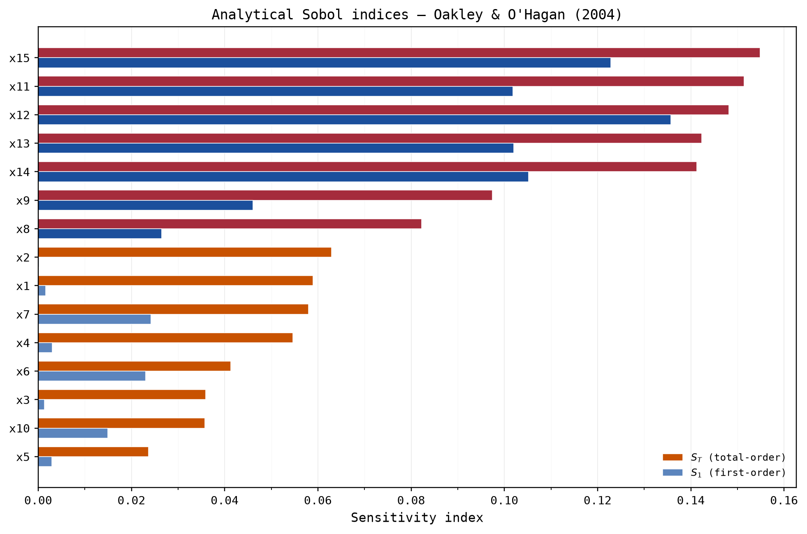
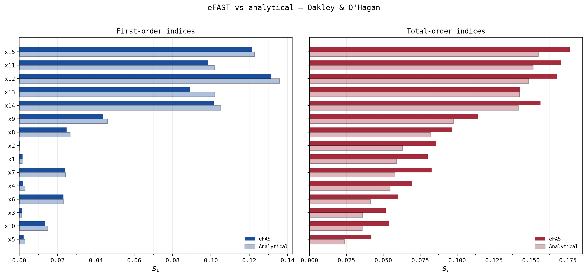
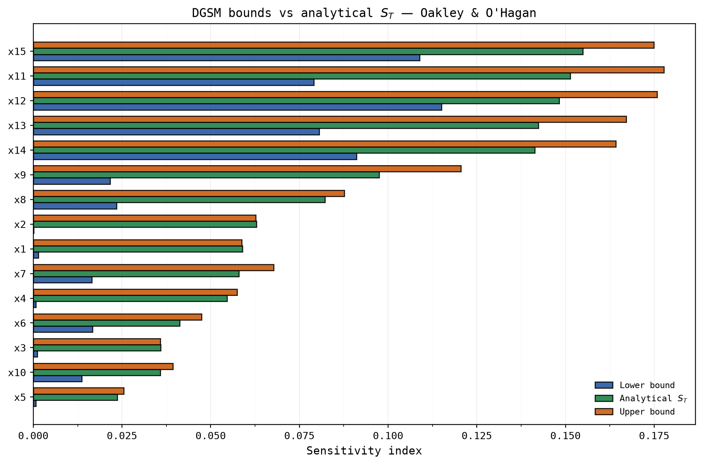
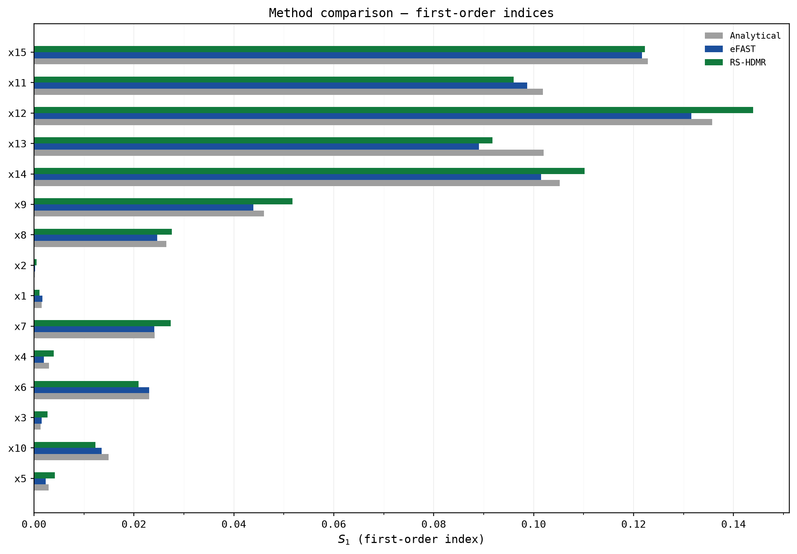

# Non-Uniform Inputs

An input's **distribution** says which values are likely, not just which values
are possible. That choice can change a sensitivity ranking even when the model
and the input's minimum and maximum stay the same.

In the example below, the third input is usually near the middle of its range.
Treating every value in that range as equally likely changes its estimated
total-order Sobol index (`ST`) and moves it from last to first:

| Distribution declared for the third input | Its `ST` | Most influential input |
| --- | ---: | --- |
| Truncated Gaussian (the intended model) | 0.2544 | `gaussian` |
| Uniform over the same range | 0.5124 | `truncated` |

Sobol indices measure contributions to output variation under the input
distributions you declare. A model can therefore have different, internally
valid indices under different assumptions about its inputs.

`jaxgsa.Problem.from_dict(...)` takes the `(low, high)` uniform shorthand and
tagged specs for Gaussian and truncated Gaussian inputs. A truncated Gaussian
is a bell-shaped distribution restricted to an interval.

The full script is [`examples/oakley_ohagan_15d.py`](https://github.com/danielepessina/jaxgsa/blob/master/examples/oakley_ohagan_15d.py), run with `uv run examples/oakley_ohagan_15d.py`.

## Declare the input distributions

Here is one input of each kind. Each key becomes the input name. A `(low, high)`
pair means uniform; `dist` identifies a Gaussian distribution.

```python
import jax.numpy as jnp
import numpy as np
from scipy.stats import truncnorm

import jaxgsa

problem = jaxgsa.Problem.from_dict(
    {
        "uniform": (0.0, 2.0),
        "gaussian": {"dist": "gaussian", "mean": 1.0, "variance": 2.25},
        "truncated": {
            "dist": "gaussian",
            "mean": 0.5,
            "variance": 1.44,
            "low": -3.1,
            "high": 4.1,
        },
    }
)
```

The third input is restricted to $[-3.1, 4.1]$, three standard deviations on
either side of its mean. Its middle values remain more likely than its edges.

For Gaussian specs, `mean` and `variance` describe the original bell-shaped
distribution before truncation. `low` and `high` are optional; you can provide
either or both. Sobol sampling draws from the resulting truncated distribution
rather than clipping samples outside the bounds.

## Run the analysis

Use a model that adds one contribution from each input. Its simplicity lets us
check the answer later. `S1` measures each input's contribution on its own;
`ST` also includes interactions. They should be nearly equal here because this
model has no interactions.

```python
coeffs = jnp.array([1.5, -0.75, 0.7])

design = jaxgsa.sobol.sample(problem, n_samples=8192, calc_second_order=False, seed=101)
X = jnp.asarray(design.samples)
Y = X @ coeffs

result = jaxgsa.sobol.analyze(design, Y)
print(np.asarray(result.ST))
```

The `ST` values are approximately:

```text
[0.2777 0.4681 0.2544]
```

The values follow the input order in `Problem.from_dict`: `uniform`,
`gaussian`, `truncated`. The Gaussian has the largest effect on output
variation in this example. The analysis log should report
`marginals: uniform=1, gaussian=2`; the truncated input counts as a Gaussian.

## Give the third input the wrong distribution

Suppose you know the third input's range but do not know its shape. It may be
tempting to declare the same bounds as a uniform distribution:

```python
wrong = jaxgsa.Problem.from_dict(
    {
        "uniform": (0.0, 2.0),
        "gaussian": {"dist": "gaussian", "mean": 1.0, "variance": 2.25},
        "truncated": (-3.1, 4.1),
    }
)

design_w = jaxgsa.sobol.sample(wrong, n_samples=8192, calc_second_order=False, seed=101, verbose=False)
Xw = jnp.asarray(design_w.samples)
result_w = jaxgsa.sobol.analyze(design_w, Xw @ coeffs)
print(np.asarray(result_w.ST))
```

The `ST` values are approximately:

```text
[0.1815 0.306  0.5124]
```

Now the third input ranks first. A uniform distribution puts more probability
near the edges of the range, so this input varies more and accounts for a
larger share of output variation. The model equation and bounds did not
change. The sensitivity question did: the two analyses describe different
input populations.

## Verify the result analytically

For this additive model, each input's Sobol index is proportional to its input
variance and the square of its coefficient. Because there are no interactions,
its first-order and total-order indices are equal in the exact answer:

$$
S_i = \frac{a_i^2 \operatorname{Var}(X_i)}{\sum_j a_j^2 \operatorname{Var}(X_j)}.
$$

We can calculate the variance of the uniform and Gaussian inputs directly.
`scipy.stats.truncnorm` supplies the truncated Gaussian variance. Its `a` and
`b` arguments express the bounds in standard deviations from the mean, unlike
the `low` and `high` values in the problem declaration.

```python
std = np.sqrt(1.44)
a, b = (-3.1 - 0.5) / std, (4.1 - 0.5) / std

variances = np.array([(2.0 - 0.0) ** 2 / 12.0, 2.25, truncnorm.var(a, b, loc=0.5, scale=std)])
weights = np.square(np.asarray(coeffs)) * variances
analytical = weights / weights.sum()

np.set_printoptions(precision=4, suppress=True)
print("S1        ", np.asarray(result.S1))
print("ST        ", np.asarray(result.ST))
print("analytical", analytical)
```

```text
S1         [0.2778 0.4679 0.2543]
ST         [0.2777 0.4681 0.2544]
analytical [0.2775 0.4683 0.2541]
```

The estimates agree closely with the analytical values. `S1` and `ST` also
agree closely, as expected for an additive model. Their small differences are
sampling error; a small gap in a real analysis is not, by itself, evidence of
an interaction.

`result.S2` is `None`, because `calc_second_order=False` never built the design
rows it needs. The output was one number per run, so `result.S1` has shape
`(D,)`. See [Multi-Output & Time-Series](/examples/multi-output) for what
happens to that shape when the model returns more.

For this example, the sampled variance of the third input rises from about
1.40 under the truncated Gaussian to 4.32 under the uniform distribution.
That explains the larger index in the second run. You can inspect the sampled
variances with `np.var(np.asarray(X), axis=0)` and
`np.var(np.asarray(Xw), axis=0)`.

When you interpret a result, check the declared marginals as carefully as the
model code. The wrong run's log says `marginals: uniform=2, gaussian=1`,
revealing that the third input was treated as uniform. A plausible ranking and
clean diagnostics cannot tell you whether the distributions reflect your real
inputs.

## High-dimensional: Oakley & O'Hagan (15 inputs)

This section puts three methods on the 15-input Oakley & O'Hagan benchmark,
where every marginal is N(0, 1) and all indices are known analytically. The
published coefficients grow toward the higher indices, which makes the inputs
an importance gradient in three tiers: x1-x5 nearly inert (analytical $S_1$
at or below 0.003), x6-x10 intermediate ($S_1$ between 0.015 and 0.046),
x11-x15 dominant ($S_1$ between 0.10 and 0.136). The first-order indices sum
to 0.7112; because that is below 1, the remaining variance lives in
interactions, so each method below must get total-order indices right, not
just main effects.



**eFAST: Gaussian inputs through the inverse CDF.** This is the first
example on this page where eFAST handles a non-uniform marginal. `sample()`
draws each search curve in uniform [0, 1] with Cukier's transform and maps
those samples through the marginal CDFs into physical space; for this
problem that mapping is the Gaussian inverse CDF. The 15 curves at 4096
points each cost 61440 model runs.

```python
efast_samples = jaxgsa.efast.sample(problem, n_per_curve=4096, M=4, seed=42)
Y_ef = oakley_ohagan.evaluate(jnp.asarray(efast_samples.samples))

efast_result = jaxgsa.efast.analyze(efast_samples, Y_ef)
print(efast_result)
```

The top five by eFAST $S_T$ are x15 (0.1761), x11 (0.1706), x12 (0.1676),
x14 (0.1565), x13 (0.1426): the x11-x15 block, with estimates a little above
the analytical values (x15: 0.1761 vs 0.1549).



**RS-HDMR: existing samples, no structured design.** RS-HDMR works from
plain i.i.d. draws: 3000 Gaussian samples, second-order component functions
(`maxorder=2`), and `m=2` basis functions per dimension.

```python
key = jax.random.key(0)
X_hd = jax.random.normal(key, (3000, problem.num_vars))
Y_hd = oakley_ohagan.evaluate(jnp.asarray(X_hd))

hdmr_result = jaxgsa.hdmr.analyze(problem, X_hd, Y_hd, maxorder=2, m=2)
print(hdmr_result)
```

The script warns that the fitted terms overlap (`S.sum() = 1.74`), so the
HDMR values run above the analytical ones (x14: 0.2466 vs 0.1413). Read them
as a ranking, which is all the comparison below uses.

**DGSM: one autodiff sweep.** DGSM needs the unbatched wrapper, defined at
its single use site. The script checks it on a zero row first:
`f(0) = 15.7560`.

```python
def oakley_fn(x):
    """Unbatched Oakley & O'Hagan: (15,) -> ()."""
    return oakley_ohagan.evaluate(x[None, :])[0]

X_dg = jaxgsa.sampling.monte_carlo(problem, n=10_000, seed=42)
dgsm_result = jaxgsa.dgsm.analyze(problem, oakley_fn, jnp.asarray(X_dg))
print(dgsm_result)
```

All 15 marginals are untruncated Gaussians, so here both bounds carry their
proofs — Poincare above, Kucherenko-Song below — and the Poincare constant
is the variance, 1, tighter than a uniform marginal of comparable width
would give. The $\nu$ ranking (x11 10.75, x12 10.63, x15 10.58, x13 10.11,
x14 9.929) already names the dominant block.



**Top-5 ranking accuracy.** The check asks each method for its five largest
total-order inputs and counts how many match the analytical top five:

| Method | Top-5 parameters | Match |
| --- | --- | ---: |
| Analytical | x11, x12, x13, x14, x15 | -- |
| eFAST ($S_T$) | x11, x12, x13, x14, x15 | 5/5 |
| RS-HDMR ($S_T$) | x8, x11, x12, x14, x15 | 4/5 |
| DGSM (upper bound) | x11, x12, x13, x14, x15 | 5/5 |

All three methods land the x11-x15 block. HDMR misses one slot: x13 drops
out and x8 (analytical $S_T$ 0.0822) takes its place, consistent with the
overlap warning above.



The method to pick depends on what you can still choose. Pick eFAST when you
can choose a structured sampling budget: 61440 runs buy the full
decomposition at 15 dimensions. Pick RS-HDMR when the dataset already
exists as plain samples: 3000 draws found the block, with one ranking
error. Pick DGSM when the model is differentiable: 10000 Monte Carlo rows
and one autodiff sweep recover the exact top five.

## Practical notes

- `Problem.from_dict(params, truncate_gaussians=q)` fills missing Gaussian
  bounds at each marginal's `q` and `1 - q` quantiles. Bounds you declared
  explicitly stay unchanged.
- Inverse-CDF sampling clips unit coordinates away from 0 and 1. An
  otherwise unbounded Gaussian is therefore sampled only within about
  $\pm 7.0345$ standard deviations.
- `problem.bounds` is `None` as soon as any Gaussian spec is present. That is
  the intended signal that the problem is no longer finite-bounds-only. Code
  that reaches for `problem.bounds` to build its own uniform sample raises on
  the `None` rather than returning a wrong answer.
- Save and load carries the marginals. The JSON metadata records the declared
  specs, so `SobolSamples.load()` rebuilds the same distributions rather than
  re-reading bounds.
- `jaxgsa.hdmr.analyze()` handles Gaussian and truncated Gaussian inputs by
  mapping through the CDF onto `[0, 1]` before it fits the surrogate.
- `jaxgsa.pce.analyze()` picks its polynomial family from how tight the
  truncation is. A narrow truncation is a different measure, so it goes through
  the truncated CDF and onto Legendre. A wide one, meaning every declared bound
  at least 5 standard deviations out, keeps Hermite, because forcing Legendre
  there makes the fit visibly worse. On Oakley-O'Hagan at order 3 the
  leave-one-out RMSE went from 0.93 to 1.70 and the largest `S1` error from
  0.0023 to 0.0054. The $\pm 3\sigma$ truncation declared on this page counts as
  narrow, so PCE would put it on Legendre. Above order 7 Legendre wins even for
  a wide truncation, because the Hermite Gram defect against a truncated measure
  grows with degree.

## See also

- [Basic Example](/examples/basic) for the smallest uniform-only run, and for
  how fast the estimator error falls with sample size.
- [Correlated Inputs](/examples/correlated-inputs) when the inputs are not
  independent, which the marginals alone cannot express.
- [Save and Reload Samples](/examples/save-load) to persist a mixed design.
- [API Reference](/api/) for the exact `TypedDict` shapes and the
  `Problem.bounds` contract.
