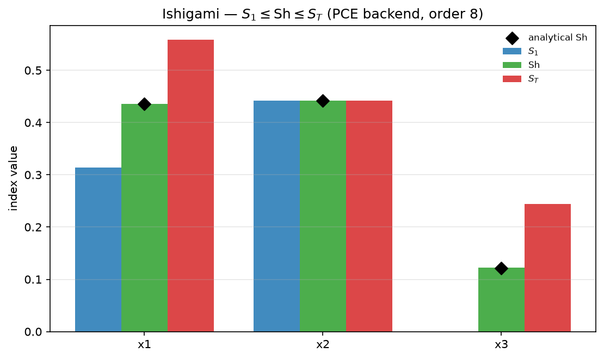
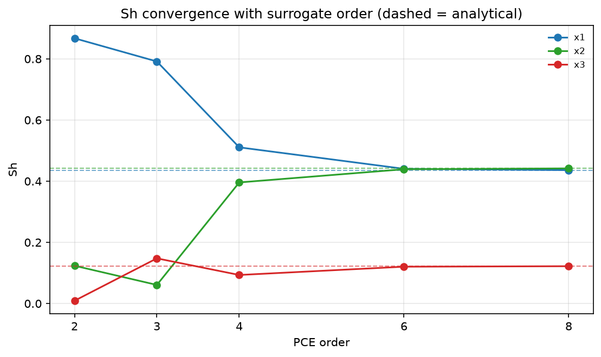

# Shapley effects

Sobol indices stop adding up when you care about interactions. `S1` sums to
less than 1, because the variance an interaction creates belongs to no single
input. `ST` sums to more than 1, because it hands that same variance to every
participant in full. Neither is a budget you can divide.

Shapley effects are the fix. You finish this page with one number per input,
the numbers sum to 1, and you have the diagnostic that says whether they are
worth reporting.

## What gets distributed, and why it sums

Fit a surrogate and you get a partial variance $V_u$ for every subset $u$ of
inputs the surrogate models. $V_{\{1\}}$ is what x1 does alone. $V_{\{1,3\}}$
is the extra variance the x1-x3 pair creates that neither creates alone. The
Shapley effect of input $i$ splits each subset's variance evenly among its
members (Owen, 2014; Song, Nelson & Staum, 2016):

$$
Sh_i = \sum_{u \,:\, i \in u} \frac{V_u}{|u|}
$$

Sum that over all $i$. Each subset $u$ is counted once for each of its $|u|$
members, at $V_u / |u|$ apiece, so it contributes exactly $V_u$. The total is
$\sum_u V_u$, the whole decomposed variance. Divide through by it and the
effects sum to 1 by construction, not by luck.

That construction is also the warning. The sum is 1 whatever the surrogate
did, including nothing useful, because it is a share of what the surrogate
captured. Fit quality lives in a separate field, `explained_variance`, and the
last section of this page is about reading it.

jaxgsa computes the allocation from a fitted surrogate's variance
decomposition, so there is no permutation Monte Carlo and no extra model runs.
`S1` and `ST` come off the same fit, which makes the bracketing
`S1 <= Sh <= ST` directly checkable.

Reach for Shapley effects when you need a single ranked importance score that
divides a fixed budget, or when interactions matter and you refuse both to
drop them (`S1`) and to double-count them (`ST`). Your inputs must be
independent; the caveats section covers what to do when they are not.

The full script is
[`examples/shapley_gsa.py`](https://github.com/danielepessina/jaxgsa/blob/master/examples/shapley_gsa.py),
run with `uv run python examples/shapley_gsa.py`.

## Import style

There is a standalone entry point, and a method on any fitted PCE or HDMR
result:

```python
import jaxgsa
# jaxgsa.shapley.analyze(problem, X, Y)   # fits, then allocates
# jaxgsa.pce.analyze(...).shapley()       # allocate from a fit you already have
# jaxgsa.hdmr.analyze(...).shapley()
```

Use `shapley.analyze` when Shapley effects are what you came for. Use
`.shapley()` when you already have a fit and want the allocation for free.

## Scalar example (Ishigami)

Ishigami is a three-input benchmark that ships with jaxgsa. Any `(X, Y)` pairs
work, so plain Monte Carlo samples are enough. `order=8` is the argument that
matters. Ishigami's sine terms need a degree-8 polynomial, and the default
`order=3` under-fits badly enough to trip the warning shown later.

```python
import jax.numpy as jnp
import jaxgsa
from jaxgsa.benchmarks.ishigami import PROBLEM, evaluate

X = jnp.asarray(jaxgsa.sampling.monte_carlo(PROBLEM, n=2000, seed=42))
Y = evaluate(X)

result = jaxgsa.shapley.analyze(PROBLEM, X, Y, order=8)

print("Sh:", result.Sh)
print("sum:", result.Sh.sum())
print("S1:", result.S1)
print("ST:", result.ST)
print("explained_variance:", result.explained_variance)
```

```text
jaxgsa.shapley.analyze
  problem: D=3 (x1, x2, x3)
    marginals: uniform=3
    correlation: independent
    output: N=2000 runs, T=1 x K=1 output slice
    invalid: none found in 2000 rows (policy 'raise')
  timing:
    backend fit + Shapley (includes compile on the first call): 2.112 s
    backend: pce
    order: 8
  results: top 3 of 3 parameters by Sh
    1. x2  Sh=0.4418
    2. x1  Sh=0.4362
    3. x3  Sh=0.122
Sh: [0.43615592 0.44182348 0.12202042]
sum: 0.9999998
S1: [3.1413424e-01 4.4180435e-01 9.9179010e-07]
ST: [0.55818665 0.4418516  0.24404898]
explained_variance: 1.0339365
```

The summary block prints by default in 1.0. `verbose=False` silences it. The
`backend: pce` line is worth a glance, because it is the default and the rest
of the page depends on which one ran.

x3 is the whole argument for this method. Its first-order index is 9.9e-07,
which is zero. x3 does nothing on its own. Its Shapley effect is 0.122,
because it owns half of the x1-x3 interaction. Rank by `S1` and you drop x3
from the model. Rank by `ST` and x3 scores 0.244, the full interaction, as
does x1 for the same variance counted twice. The Shapley split of 0.122 each
is the honest answer.

Ishigami has exactly one two-way interaction, so `Sh = (S1 + ST) / 2` holds
here and you can check it by hand: `(0.31413 + 0.55819) / 2 = 0.43616`.

x2 is the purely additive input on Ishigami — it enters only through
`7 * sin(x2)^2` — so all three indices coincide for it: `S1 = 0.4418`,
`Sh = 0.4418` and `ST = 0.4419` here, against an exact 0.4424. Where the three
indices agree, the input acts alone and any one of them is the whole story.

The sum prints 0.9999998 rather than 1. That is float32 rounding over a
165-term expansion, not a modelling gap. Do not chase it.



## Ground-truth check

Ishigami, the linear model and Sobol-G ship analytical Shapley effects, so you
can check against truth rather than against another implementation:

```python
import numpy as np
from jaxgsa.benchmarks import ishigami

print("estimated: ", np.round(result.Sh, 4))
print("analytical:", np.round(ishigami.ANALYTICAL_SHAPLEY, 4))
```

```text
estimated:  [0.4362     0.4418     0.12199999]
analytical: [0.4357 0.4424 0.1218]
```

Three decimals on all three inputs, worst gap 0.0006 on x2. Same ranking.

The script's own check is the same comparison as asserts, so it fails loudly
instead of printing:

```python
import numpy as np
from jaxgsa.benchmarks import ishigami

sh = np.asarray(result.Sh)
assert np.isclose(sh.sum(), 1.0, atol=1e-4)
print(f"sum(Sh) = {sh.sum():.6f}   (Shapley efficiency: exactly 1)")
print(f"max |error| = {np.max(np.abs(sh - ishigami.ANALYTICAL_SHAPLEY)):.4f}")
```

```text
sum(Sh) = 1.000000   (Shapley efficiency: exactly 1)
max |error| = 0.0006
```

## What it costs

Very little, and that is the point. The allocation is one matrix product
against a boolean membership matrix of shape `(n_terms, D)`. On the fit above,
165 terms and 3 inputs on an Apple M1 Pro, `.shapley()` takes 0.37 ms against
12.5 ms to redo the PCE fit. It costs zero model evaluations.

Compare that with the permutation Monte Carlo estimator, which walks random
orderings of the inputs and needs a fresh batch of model runs at each step.
Reading the effects off a surrogate replaces those runs with a fit you were
going to do anyway. The bill you actually pay is the fit, and the fit is
shared with `S1` and `ST`.

## Order as a convergence knob

`order` is the surrogate's polynomial degree, and it is the knob you turn to
make the allocation trustworthy. Sweep it on the same `(X, Y)` pair — no new
model runs — and watch `explained_variance` approach 1 while the error against
the analytical effects shrinks:

```python
import numpy as np
from jaxgsa.benchmarks import ishigami

for order in (2, 3, 4, 6, 8):
    r = jaxgsa.pce.analyze(PROBLEM, X, Y, order=order).shapley()
    err = float(np.max(np.abs(np.asarray(r.Sh) - ishigami.ANALYTICAL_SHAPLEY)))
    print(f"order={order}  explained_variance={float(r.explained_variance):.3f}"
          f"  max |Sh - analytical| = {err:.4f}")
```

```text
order=2  explained_variance=0.242  max |Sh - analytical| = 0.4315
order=3  explained_variance=0.476  max |Sh - analytical| = 0.3815
order=4  explained_variance=0.745  max |Sh - analytical| = 0.0749
order=6  explained_variance=0.983  max |Sh - analytical| = 0.0047
order=8  explained_variance=1.000  max |Sh - analytical| = 0.0006
```

Two things to notice. Even `order=2` still sums to 1 — the efficiency
normalization guarantees it — but it captured 24% of `Var(Y)`, so its shares
describe a truncated surrogate, not the model. `order=3` under-fits here too,
at `explained_variance = 0.476`, which is why the default order trips the
below-0.5 warning on this benchmark. The allocation is only as good as the
fit: `order=8` reproduces the analytical effects to 0.0006. Each result also
reports the order it actually fit as `result.order` (`effective order: 8` in
the scalar run above), so a saved analysis records its own truncation.



## Backends

`backend` picks the surrogate that supplies the partial variances. The default
is `"pce"`.

`backend="pce"` reads subset variances off orthonormal polynomial
coefficients (Sudret, 2008), exact within the fitted polynomial. Its knobs are
`order` (default 3), `ridge` and `fit_ratio`. It refuses a declared
`problem.correlation`.

`backend="hdmr"` fits the RS-HDMR B-spline surrogate and allocates its
structural ANCOVA variances, truncated at `maxorder`. Its knobs are `maxorder`
(default 2), `m`, `maxiter`, `lambdax` and `slice_chunk_size`. It accepts a
declared correlation with `include_correlative=True`.

Both take `(N,)`, `(N, K)` and `(N, T, K)` outputs as of 1.0. Older docs
saying the PCE backend is scalar-only are wrong.

Backend knobs are not shared. Passing `maxorder=3` with `backend="pce"` raises
`TypeError: analyze() got an unexpected keyword argument 'maxorder'` rather
than being ignored, so a typo cannot quietly change nothing.

Pick PCE for smooth responses, where it is exact and cheap. Pick HDMR for
responses with kinks or plateaus, and for correlated inputs, which PCE
refuses.

v1 limitation: both backends assume independent inputs for the allocation. The
caveats below say what each one does if you declare a correlation anyway.

## Multi-output example (HDMR backend)

N is samples, D inputs, K outputs, T timepoints. `(N, K)` gives indices of
shape `(K, D)`, and every output row sums to 1 on its own. `(N, T, K)` gives
`(T, K, D)`.

This example adds a second output with a known answer. Y2 is a sum of squares
over symmetric bounds, so it has no interactions and its three inputs are
interchangeable. Its shares must come out at 1/3 each, which is how you check
the multi-output path did not scramble an axis. `m=4` widens the B-spline
basis, for the reason on the [RS-HDMR page](/examples/hdmr).

```python
import jax.numpy as jnp
import jaxgsa
from jaxgsa.benchmarks.ishigami import PROBLEM, evaluate

X = jnp.asarray(jaxgsa.sampling.monte_carlo(PROBLEM, n=2000, seed=42))
Y1 = evaluate(X)
Y2 = jnp.sum(X**2, axis=1)
Y_multi = jnp.column_stack([Y1, Y2])

result = jaxgsa.shapley.analyze(PROBLEM, X, Y_multi, backend="hdmr", m=4)

print("Sh:", result.Sh)
print("row sums:", result.Sh.sum(axis=-1))
print("explained_variance:", result.explained_variance)
```

```text
jaxgsa.shapley.analyze
  problem: D=3 (x1, x2, x3)
    marginals: uniform=3
    correlation: independent
    output: N=2000 runs, T=1 x K=2 output slices
    invalid: none found in 2000 rows (policy 'raise')
  timing:
    backend fit + Shapley (includes compile on the first call): 2.266 s
    backend: hdmr
    order: 2
  results: top 3 of 3 parameters by Sh, mean over 2 output slices
    1. x2  Sh=0.3943
    2. x1  Sh=0.3734
    3. x3  Sh=0.2323
Sh: [[0.4217161  0.45171946 0.12656444]
 [0.32505286 0.3369298  0.33801743]]
row sums: [1.        1.0000001]
explained_variance: [1.0094421 0.9541204]
```

Row 1 is Ishigami and reproduces the scalar answer to two decimals. Row 2 is
the sum of squares and comes out `[0.325, 0.337, 0.338]`, within 0.01 of the
1/3 the construction demands. The residual spread is finite-sample noise in a
2000-row fit.

The `results:` table averages over output slices, which is fine for a quick
glance and useless when the outputs disagree. Read `result.Sh` per row.
`explained_variance` also has one entry per output, so a bad fit on one output
cannot hide behind a good fit on the other.

## The `explained_variance` diagnostic

`Sh` is normalized by the surrogate's total decomposed variance $\sum_u V_u$,
so it sums to 1 however badly the surrogate fits. Fit quality is reported
separately:

$$
\text{explained\_variance} = \frac{\sum_u V_u}{\mathrm{Var}(Y)}
$$

Near 1 is a faithful surrogate. Below 1 means truncation or fit error left
variance unexplained. Above 1 means an overfit surrogate over-counted shared
variance. A `JaxgsaWarning` fires below 0.5 or above 1.3.

Here is what a bad fit looks like. Same data, `order=2`:

```python
low = jaxgsa.pce.analyze(PROBLEM, X, Y1, order=2, verbose=False).shapley()
print("Sh:", low.Sh)
print("sum:", low.Sh.sum())
print("explained_variance:", low.explained_variance)
```

```text
JaxgsaWarning: jaxgsa.shapley: surrogate explained_variance is below 0.5;
Shapley effects may be unreliable
Sh: [0.86724067 0.12359249 0.0091669 ]
sum: 1.0000001
explained_variance: 0.24137108
```

The sum is still 1. The effects are still ordered, positive, and completely
wrong: x1 gets 0.867 against its true 0.436, x2 collapses from 0.442 to 0.124,
and x3 all but vanishes. A degree-2 polynomial captured 24% of Ishigami's
variance, and these are honest shares of that 24%.

The sum tells you nothing about fit quality. Only `explained_variance` does.
Read it first, every time. If it is off, raise `order` or `maxorder` and refit
until it settles near 1.

One consequence of the normalization. With `backend="pce"` the `S1` and `ST`
on the result match `jaxgsa.pce.analyze` exactly. With `backend="hdmr"` they
differ from `jaxgsa.hdmr.analyze`'s by a factor of `explained_variance`,
because HDMR normalizes by `Var(Y)` instead.

## xarray export

`to_dataset()` returns a labeled `xarray.Dataset`, so you select an input or
an output by name:

```python
ds = result.to_dataset()
print(ds)
print(ds.Sh.sel(param="x1").values)
```

```text
<xarray.Dataset> Size: 120B
Dimensions:             (output: 2, param: 3)
Coordinates:
  * output              (output) <U2 16B 'y0' 'y1'
  * param               (param) <U2 24B 'x1' 'x2' 'x3'
Data variables:
    Sh                  (output, param) float32 24B 0.4217 0.4517 ... 0.338
    S1                  (output, param) float32 24B 0.3006 0.4445 ... 0.338
    ST                  (output, param) float32 24B 0.5428 0.4589 ... 0.338
    explained_variance  (output) float32 8B 1.009 0.9541
Attributes:
    backend:              hdmr
    order:                2
    include_correlative:  False
[0.4217161  0.32505286]
```

`ds.Sh.sel(param="x1")` gives x1's share for each output. `explained_variance`
carries no `param` dimension, so it prints one value per output. The
attributes record which backend and truncation produced the numbers, which
matters when the dataset outlives the session. Set `problem.output_names` to
replace `y0` and `y1` with real names, and pass `time_coords` to label a time
dimension.

## Shape rules

| Y shape | backend | Sh / S1 / ST shape | explained_variance |
|---------|---------|--------------------|--------------------|
| `(N,)` | pce or hdmr | `(D,)` | `()` |
| `(N, K)` | pce or hdmr | `(K, D)` | `(K,)` |
| `(N, T, K)` | pce or hdmr | `(T, K, D)` | `(T, K)` |

D is always the last axis. Without `problem.output_names`, a 2D `Y` is read as
`(N, K)`. With exactly one entry in `output_names` it is read as `(N, T)`,
timepoints of that single output, and flows through as `(N, T, 1)`. A
pre-reshaped `(N, T, 1)` array works too.

## Practical caveats

**Independent inputs are assumed, and the PCE backend enforces it.** Pass a
problem with a declared `correlation` and `shapley.analyze` raises
`ValueError` rather than returning a silently wrong allocation. The message
names the alternatives.

**The HDMR route under dependence is an approximation, not a Shapley effect.**
`backend="hdmr"` with `include_correlative=True` allocates the total ANCOVA
contribution `Sa + Sb` and does accept a declared correlation. It is an
ANCOVA-based attribution. A true conditional-variance Shapley effect needs an
estimator of the variance remaining once a group of inputs is held fixed, and
jaxgsa does not have one yet. For conditional-variance indices under
dependence, leave Shapley behind: [VKOGA](/examples/vkoga) works from given
data through a kernel surrogate, [Kucherenko](/examples/kucherenko) uses its
own design and your actual model. Neither returns a per-parameter allocation
summing to 1.

**Interactions past the truncation are simply absent.** Anything beyond
`order` for PCE or `maxorder` for HDMR contributes nothing to the allocation,
and `explained_variance` is the only place that absence shows up.

**The HDMR backend inherits `jaxgsa.hdmr.analyze`'s contract**: at least 300
samples, `maxorder` in `{1, 2, 3}`, clamped with a warning when
`D < maxorder`.

## See also

- [PCE](/examples/pce) for the default backend's surrogate, its leave-one-out
  error and its emulator.
- [RS-HDMR](/examples/hdmr) for the multi-output backend's surrogate.
- [Basic Example](/examples/basic) for the Sobol workflow when you can afford
  a structured Saltelli design.
- [Borgonovo Delta](/examples/borgonovo) for a moment-independent importance
  measure from the same given-data setting.
- [Methods](/guide/methods) for the theory and when to prefer Sh over S1/ST.
- [API Reference](/api/#shapley-effects) for full parameter documentation.
