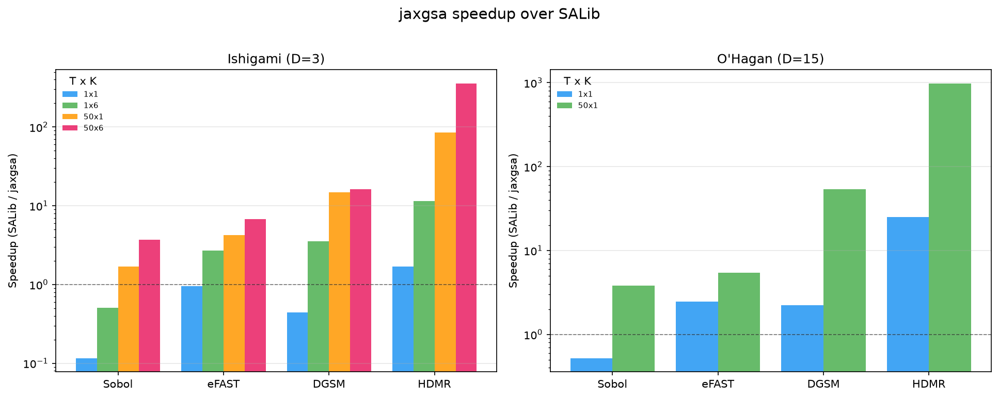
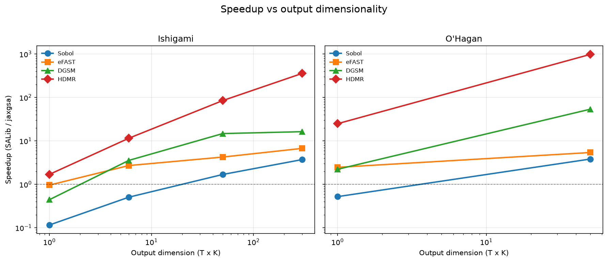
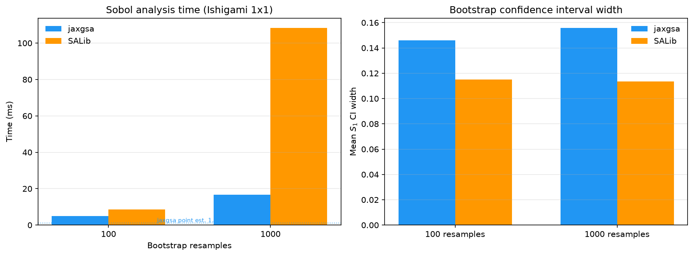

# Benchmarks

Two separate things live on this page, and they answer different questions.

The [test functions](#test-functions) answer "is this method correct?". Their
indices are known in closed form, so you can measure an estimator's error
rather than guess at it.

The [timing comparison](#timing-against-salib) answers "how long does the
analysis step take against SALib on one CPU core?". Read the
[caveats](#what-the-timings-do-not-measure) before you quote a number from it.
Every speedup on this page is measured against single-process NumPy, and the
biggest ones measure a Python loop rather than arithmetic.

## Test functions

`jaxgsa.benchmarks` ships five analytical models. Each submodule provides a
`PROBLEM`, a batched `evaluate(X)`, precomputed `ANALYTICAL_*` arrays, and an
`analytical_*(...)` function for non-default parameters.

All five give `S1`, `ST` and `S2`. Three of the five also give Shapley
effects: `ishigami`, `sobol_g`, and `linear`. `gaussian_linear` gives a
Borgonovo delta and an optimal-transport index instead, which makes it the
only ground truth in the library for a moment-independent estimator.
`oakley_ohagan` gives neither Shapley effects nor a moment-independent
ground truth; it ships the published `PUBLISHED_S1` literal alongside its
own closed-form `S1`/`ST`/`S2`.

| Module | D | Marginals | Extra ground truth |
| --- | ---: | --- | --- |
| `ishigami` | 3 | uniform on $[-\pi, \pi]$ | |
| `sobol_g` | 8 | uniform on $[0, 1]$ | |
| `linear` | 3 | uniform on $[0, 1]$ | |
| `gaussian_linear` | 3 | $\mathcal{N}(0, 1)$ | `ANALYTICAL_DELTA`, `ANALYTICAL_OT` |
| `oakley_ohagan` | 15 | $\mathcal{N}(0, 1)$ | `PUBLISHED_S1` |

### `ishigami`

$f(x) = \sin(x_1) + A \sin^2(x_2) + B x_3^4 \sin(x_1)$, with
$x_i \sim U[-\pi, \pi]$ and defaults $A = 7$, $B = 0.1$.

Pick this one when you want to check that a method separates a zero
first-order effect from a non-zero total effect. $x_3$ enters only through its
interaction with $x_1$, so the exact answer is $S_1 = 0$ and $S_T = 0.2437$.
A method that reports $x_3$ as unimportant has failed.

| Exact | $x_1$ | $x_2$ | $x_3$ |
| --- | ---: | ---: | ---: |
| `ANALYTICAL_S1` | 0.3139 | 0.4424 | 0.0000 |
| `ANALYTICAL_ST` | 0.5576 | 0.4424 | 0.2437 |
| `ANALYTICAL_SHAPLEY` | 0.4357 | 0.4424 | 0.1218 |

`evaluate(X, A=7.0, B=0.1)` maps `(N, 3)` to `(N,)`.
`analytical_indices(A=7.0, B=0.1)` returns `(S1, ST, S2)`;
`analytical_shapley(A=7.0, B=0.1)` returns the effects.

The $[-\pi, \pi]$ domain and `A=7, B=0.1` are the SALib convention, and
jaxgsa pins them as the default because at least three conventions circulate
in the literature with very different indices (`A=7, B=0.05` gives
`S1=0.2185`; `A=2, B=1` gives `S1=0.3830`). Other papers use other constants
and get different reference numbers, so check the domain and both constants
before you compare against a published table, and treat a published
Ishigami table as unverified until you have re-derived at least one row.
Azzini and Rosati (2022), *Data in Brief* 42:108071, for example, prints a
first-order 0.4413 for $x_2$ against a total of 0.4424111. $x_2$ has no
interactions, so the two must be equal, and it is the first-order figure that
is wrong.

### `sobol_g`

$g(\mathbf{x}) = \prod_{j=1}^{D} \frac{|4x_j - 2| + a_j}{1 + a_j}$ with
$x_j \sim U[0, 1]$.

Eight dimensions, and the `a` vector sets importance directly: $a_j = 0$ makes
$x_j$ maximally influential, and a large $a_j$ makes it nearly inert. The
default `a = (0, 1, 4.5, 9, 99, 99, 99, 99)` gives four tiers, with the last
four parameters at $S_1 \approx 10^{-4}$.

Pick this one to test screening. A screening method has to put those four
parameters at the bottom and keep them there. The exact `S1` is
`[0.7162, 0.1790, 0.0237, 0.0072, 0.0001, 0.0001, 0.0001, 0.0001]`.

`evaluate(X, a=DEFAULT_A)` maps `(N, 8)` to `(N,)`.

### `linear`

$f(\mathbf{x}) = \sum_j c_j x_j$ with $x_j \sim U[0, 1]$ and
$c = (1, 2, 3)$.

The model is purely additive, so $S_1 = S_T = (0.0714, 0.2857, 0.6429)$ and
every second-order index is exactly zero. That exact zero is the point: use it
to check that a method does not manufacture interactions out of sampling
noise.

`analytical_indices(coeffs, bounds)` covers other coefficients and other
bounds.

### `gaussian_linear`

The same additive model with $x_j \sim \mathcal{N}(0, \sigma_j^2)$.

Gaussian marginals make the output and every conditional output Gaussian, so
more than the variance indices come out in closed form. `analytical_delta`
computes the Borgonovo delta from a closed-form L1 distance between Gaussians
plus a 1-D Gauss-Hermite quadrature (`quad_order=61` by default), giving
`ANALYTICAL_DELTA = [0.0890, 0.2016, 0.3874]`. `analytical_ot` gives
`ANALYTICAL_OT = [0.0364, 0.1548, 0.4024]`.

This is the only ground truth in the library for `jaxgsa.borgonovo` and
`jaxgsa.optimal_transport`. Every other benchmark checks variance-based
methods only.

### `oakley_ohagan`

Oakley and O'Hagan (2004), 15 dimensions:
$f(\mathbf{x}) = \mathbf{a}_1^\top \mathbf{x} + \mathbf{a}_2^\top \sin(\mathbf{x}) + \mathbf{a}_3^\top \cos(\mathbf{x}) + \mathbf{x}^\top M \mathbf{x}$
with $x_i \sim \mathcal{N}(0, \sigma^2)$.

The only benchmark here with more than 8 dimensions, and one of the few
standard sensitivity benchmarks with Gaussian rather than uniform inputs. The
inputs are independent; the quadratic form creates every pairwise interaction between
their effects, and no
single parameter dominates: the largest $S_1$ is 0.136 and the largest $S_T$
is 0.155. That flat profile is harder for a ranking method than Ishigami is.

The module carries `PUBLISHED_S1`, the reference table from the paper, next to
the derivation-based `ANALYTICAL_S1`. They agree to 1.7e-5, which is what you
would expect from a table printed to six decimals. If you change the
derivation, that comparison is the test that catches you.

### Measuring an estimator's error

```python
import jaxgsa
from jaxgsa.benchmarks import ishigami

sr = jaxgsa.sobol.sample(ishigami.PROBLEM, 65536, seed=0, verbose=False)
result = jaxgsa.sobol.analyze(sr, ishigami.evaluate(sr.samples), verbose=False)

print("max S1 error:", abs(result.S1 - ishigami.ANALYTICAL_S1).max())
print("max ST error:", abs(result.ST - ishigami.ANALYTICAL_ST).max())
```

```
max S1 error: 0.00041368604
max ST error: 0.00035494566
```

Note that `sobol.sample` takes a total run count, not a base sample count. At
`n_samples=65536` with `D=3` and second-order on, the base sample is 8192 and
you evaluate 65536 rows.

Repeating that with `seed=0` at three sizes gives the convergence you should
expect from a Saltelli column-swap design on this function:

| `n_runs` | max $\lvert S_1 - \text{exact} \rvert$ | max $\lvert S_T - \text{exact} \rvert$ |
| ---: | ---: | ---: |
| 8,192 | 0.00842 | 0.00239 |
| 65,536 | 0.00041 | 0.00035 |
| 524,288 | 0.00002 | 0.00000 |

Each 8x in `n_runs` cuts the error by about 20x. Plain Monte Carlo would give
$\sqrt{8} \approx 2.8$x, so the scrambled Sobol' sequence is doing real work
here, which is what you expect on a smooth low-dimensional function. Do not
read these as tolerances for your own model. They are the error on this
function, at this seed, in float32.

## Timing against SALib

The comparison times the **analysis step only**, which computes indices from
outputs you already have. Model evaluation is excluded, and on a real model
that is where almost all the wall time goes. A 100x speedup on a step that
took 20 ms does not make your study 100x faster.

**What was measured.** `jaxgsa.sobol.analyze` with and without second-order
indices, and `jaxgsa.hdmr.analyze`, on a coupled damped-oscillator model with
`D=5` parameters and `base_n=1024`. Four output shapes, written `T x K` for
`T` timepoints and `K` outputs.

**Hardware and versions.** Apple M1 Pro (8 cores, 6 performance and 2
efficiency), CPU only, no GPU. macOS, Python 3.12.13, JAX 0.10.2,
SALib 1.5.2. Every number in the tables below was re-measured on this
software stack for the 1.0 release, not carried over from an earlier one.

**Method.** Best of 5 identical runs on the same data, except the SALib HDMR
path at best of 2 because each of its slices costs about a second. The jaxgsa
figures are post-JIT steady state; the one-off XLA compile, 0.3 to 1.1 s
depending on the shape, is paid once per process and excluded. SALib is pure
NumPy and SciPy and needs no compilation. Every jaxgsa call runs with
`verbose=False`, and every timed jaxgsa result is blocked with
`jax.block_until_ready` before the clock stops.

::: warning The baseline is one CPU core
Every "speedup" below is single-process jaxgsa on an M1 Pro CPU against
single-process NumPy SALib on one core of the same machine, which is what
SALib does by default. It is not a comparison against a parallel CPU baseline
or a tuned GPU, where published speedups for Monte Carlo GSA are closer to
13x. The large HDMR numbers in particular come from SALib running a Python
loop over output slices. See
[what the timings do not measure](#what-the-timings-do-not-measure).
:::

### Sobol, no bootstrap

`D=5`, `base_n=1024`, `n_bootstrap=0`. Speedup is SALib time divided by jaxgsa
time, so above 1.0 means jaxgsa is faster.

| Scenario (T x K) | Method | jaxgsa (ms) | SALib (ms) | Speedup |
| --- | --- | ---: | ---: | ---: |
| 1 x 1 | analyze, no S2 | 0.9 | 0.2 | 0.2x |
| 1 x 1 | analyze with S2 | 1.3 | 0.8 | 0.6x |
| 1 x 6 | analyze, no S2 | 1.3 | 1.4 | 1.0x |
| 1 x 6 | analyze with S2 | 1.7 | 5.5 | 3.3x |
| 50 x 1 | analyze, no S2 | 3.5 | 12.5 | 3.6x |
| 50 x 1 | analyze with S2 | 4.3 | 45.4 | 10.6x |
| 50 x 6 | analyze, no S2 | 13.0 | 74.4 | 5.7x |
| 50 x 6 | analyze with S2 | 19.1 | 285.6 | 15.0x |

The two 1 x 1 rows are the honest ones. On a single scalar output SALib is
faster, by about 4x without second order. There is not enough work in a `D=5`,
`N=1024` scalar analysis to pay back JAX dispatch, and no amount of kernel
fusion fixes that. Use jaxgsa there for the gradients and the device
placement, not for the milliseconds.

### Sobol, 300 bootstrap resamples

Same design, `n_bootstrap=300`.

| Scenario (T x K) | Method | jaxgsa (ms) | SALib (ms) | Speedup |
| --- | --- | ---: | ---: | ---: |
| 1 x 1 | analyze, no S2 | 31.7 | 20.8 | 0.7x |
| 1 x 1 | analyze with S2 | 33.9 | 70.3 | 2.1x |
| 1 x 6 | analyze, no S2 | 44.2 | 143.0 | 3.2x |
| 1 x 6 | analyze with S2 | 71.7 | 459.4 | 6.4x |
| 50 x 1 | analyze, no S2 | 508.1 | 1134.3 | 2.2x |
| 50 x 1 | analyze with S2 | 613.4 | 3782.6 | 6.2x |
| 50 x 6 | analyze, no S2 | 2541.4 | 7964.0 | 3.1x |
| 50 x 6 | analyze with S2 | 3662.6 | 23805.1 | 6.5x |

Bootstrap narrows the gap rather than widening it. The resampling itself is
`O(n_bootstrap)` work on both sides, so the fixed per-slice Python cost that
jaxgsa avoids becomes a smaller share of the total. The scalar no-S2 case is
still a loss.

### HDMR

`maxorder=2`, `m=2`, 1,024 random samples, no bootstrap.

| Scenario (T x K) | jaxgsa (ms) | SALib (ms) | Speedup |
| --- | ---: | ---: | ---: |
| 1 x 1 | 7.4 | 80.3 | 10.9x |
| 1 x 6 | 8.2 | 513.1 | 62.9x |
| 50 x 1 | 9.5 | 3958.9 | 417.2x |
| 50 x 6 | 27.4 | 29059.7 | 1060.1x |

Do not quote the 1060x on its own. It is 300 output slices against
single-process SALib, and SALib refits its whole HDMR backfitting loop once
per slice in Python. jaxgsa fits all 300 in one compiled pass, and its own
time only grows from 7.4 ms to 27.4 ms across a 300-fold increase in output
slices. That flatness is the real finding. The ratio is mostly a statement
about how SALib is structured.

### eFAST, DGSM, and the 15-D case

The oscillator benchmark above covers Sobol and HDMR. A second script,
[`examples/benchmark_all.py`](https://github.com/danielepessina/jaxgsa/blob/master/examples/benchmark_all.py),
adds eFAST and DGSM, and runs both problems this page already uses — Ishigami
(D=3) and Oakley-O'Hagan (D=15) — so the effect of dimension is visible in the
same table. Same measurement rules as the oscillator benchmark: analysis step
only, best of 3, `verbose=False`, blocked before the clock stops. The numbers
below are the cache-backed run (`examples/benchmark_cache.json`), so they are
reproducible without re-running the benchmark.

**eFAST.** eFAST evaluates the model along sinusoidal search curves — one per
parameter — and reads $S_1$ and $S_T$ out of the Fourier spectrum of the
output. Both libraries use `n_per_curve=2049`, `M=4`. jaxgsa matches or beats
SALib on every row except the scalar one, which is a tie:

| Problem | Scenario (T x K) | jaxgsa (ms) | SALib (ms) | Speedup |
| --- | --- | ---: | ---: | ---: |
| Ishigami (D=3) | 1x1 | 0.6 | 0.5 | 1.0x |
| Ishigami (D=3) | 1x6 | 1.1 | 2.9 | 2.7x |
| Ishigami (D=3) | 50x1 | 5.7 | 24.1 | 4.2x |
| Ishigami (D=3) | 50x6 | 23.1 | 155.6 | 6.7x |
| O'Hagan (D=15) | 1x1 | 1.0 | 2.4 | 2.5x |
| O'Hagan (D=15) | 50x1 | 22.7 | 122.8 | 5.4x |

**DGSM.** The two libraries are not timing the same job. The jaxgsa row times
`jaxgsa.dgsm.analyze(problem, Y=..., dfdx=...)` on a pre-computed Jacobian;
the autodiff sweep that produces `dfdx` is excluded from the timer. The SALib
row times `SALib.analyze.dgsm.analyze(...)` on finite-difference samples, and
the finite differences are computed inside the timed region, so SALib pays for
derivative work that the jaxgsa timer does not:

| Problem | Scenario (T x K) | jaxgsa (ms) | SALib (ms) | Speedup |
| --- | --- | ---: | ---: | ---: |
| Ishigami (D=3) | 1x1 | 0.6 | 0.3 | 0.4x |
| Ishigami (D=3) | 1x6 | 0.4 | 1.5 | 3.6x |
| Ishigami (D=3) | 50x1 | 0.9 | 13.1 | 14.7x |
| Ishigami (D=3) | 50x6 | 5.4 | 88.3 | 16.3x |
| O'Hagan (D=15) | 1x1 | 0.6 | 1.4 | 2.2x |
| O'Hagan (D=15) | 50x1 | 1.3 | 68.5 | 53.7x |

**Higher D amplifies the gap.** Every method's speedup grows between Ishigami
(D=3) and O'Hagan (D=15). The 50x1 rows show the pattern: DGSM goes from 14.7x
to 53.7x, HDMR from 84.8x to 980.2x, Sobol from 1.7x to 3.8x, and eFAST from
4.2x to 5.4x. The D=15 HDMR 50x1 row is the extreme: SALib takes 60,039.5 ms —
about a minute — for 50 slices, against jaxgsa's 61.3 ms. The SALib analysis
time grows far faster with dimension than jaxgsa's does: on DGSM 50x1, SALib
goes from 13.1 ms to 68.5 ms while jaxgsa goes from 0.9 ms to 1.3 ms. The ratio
widens because SALib re-enters Python once per output slice, and each slice's
work grows with D; see [where the difference comes from](#where-the-difference-comes-from).

**Bootstrap confidence intervals.** The script also compares bootstrap
confidence intervals on Ishigami 1x1 Sobol (`base_n=1024`,
`ci_method="gaussian"` on both sides). The mean $S_1$ CI width lands in the
same range in both libraries: jaxgsa 0.146 at 100 resamples and 0.156 at 1000;
SALib 0.115 at 100 and 0.113 at 1000. jaxgsa's measured width runs about a
quarter to a third wider at each count, and neither width narrows from 100 to
1000 resamples. The flatness is the expected bootstrap behavior: the resample
count $B$ sets how precisely the width is *estimated*, and that error falls
like $1/\sqrt{B}$, while the width itself is set by the base sample size. The
resampling cost is where jaxgsa pulls ahead: 4.9 ms and 16.8 ms at 100 and
1000 resamples against SALib's 8.6 ms and 108.3 ms (jaxgsa's no-resample point
estimate is 1.2 ms).

**Speedup tracks T x K.** The scaling story is the same one this page tells
for the oscillator: the ratio grows with the output slice count, and the
scalar rows remain the weak spot — Sobol 1x1 is 0.1x on Ishigami and 0.5x on
O'Hagan, DGSM 1x1 is 0.4x — for the reasons given in
[where the difference comes from](#where-the-difference-comes-from). eFAST 1x1
is a tie and HDMR 1x1 still wins (24.9x at D=15), because SALib's HDMR is
heavy even for one slice.

**The script.** `benchmark_all.py` is a plain script: it runs top to bottom,
prints the tables above, and shows three figures. Results cache to
`examples/benchmark_cache.json`, and the default run loads that cache; pass
`--refresh` to re-run the benchmarks:

```bash
uv run --extra dev python examples/benchmark_all.py
```

Unlike [`benchmark_salib.py`](https://github.com/danielepessina/jaxgsa/blob/master/benchmark_salib.py),
`benchmark_all.py` has no correctness gate: it does not check jaxgsa against
SALib or against the analytical indices. `benchmark_salib.py` is the
correctness-checked reproduction behind this page's Sobol and HDMR tables.

## Where the difference comes from

SALib analyzes each `(t, k)` output slice in a Python loop. For the 50 x 6
case that is 300 sequential calls into the analyzer, each with its own array
allocations and its own pass over the sample.

jaxgsa does four things differently.

- **One fused kernel per call.** It computes the pooled variance once and
  derives every `S1`, `ST` and `S2` index from it, instead of recomputing it
  `2D` times per output slice.
- **`jax.vmap` over all `T*K` slices** in a single compiled pass, so the
  per-slice Python cost disappears.
- **A scalar fast path** when `T*K == 1`, which skips the vmap machinery
  entirely.
- **JIT**, so a bootstrap loop or a parameter sweep reuses one compiled
  kernel while SALib re-enters Python every time.

That is why the ratio tracks `T*K` and not `D`. SALib's cost is linear in the
slice count; jaxgsa's is close to flat until the arrays stop fitting in cache.
At `T*K == 1` the ordering flips and SALib wins, because jaxgsa still pays JAX
dispatch overhead on a job too small to amortize it.

## What the timings do not measure

Four limits, in the order a reviewer will raise them.

**The baseline is single-process NumPy on one core.** SALib does not
parallelize its output-slice loop, and the benchmark does not add parallelism
for it. A user with `P` cores
can run that loop across `P` processes and divide the SALib column by up to
`P`. This machine has 8 cores, so a perfectly parallel SALib would cut the
HDMR 50 x 6 ratio from 1060x to about 130x. Quote the table as "against
single-process SALib", never as "faster than SALib".

**The largest ratios measure loop overhead, not arithmetic.** The HDMR 50 x 6
number is dominated by 300 Python-level refits. It says jaxgsa's vectorization
removes a scheduling cost that SALib pays. It does not say jaxgsa's floating
point is hundreds of times faster, and it does not transfer to a workload with
one output slice, where the same comparison gives 10.9x.

**Cost claims carry a `T` factor.** Every speed or cost statement in this
project states `T` or says it is scalar-output-only. One reverse-mode pass
returns one *row* of the Jacobian, so a model with `T*K` output slices costs
`T*K` reverse passes. The textbook argument that a gradient costs about 3
model runs, and so beats a `N*(D+2)` Saltelli design for `D >= 2`, holds only
at `T*K = 1`. At `T*K = 10` the crossover moves to `D > 28`. This is why
`jaxgsa.dgsm` picks `jax.jacfwd` when `T*K > D` and `jax.jacrev` otherwise.
A benchmark table that does not say what `T` was is not comparable.

**These are CPU numbers.** No GPU or TPU figures appear on this page, because
none have been measured on hardware this project controls. Published speedups
for large Monte Carlo GSA on a GPU against a fully parallel CPU sit near 13x,
so treat a GPU as a further win of about that size at most, not as a
multiplier on the tables above.

## Setup and reproduction

- **Model:** coupled damped oscillators, `D=5` parameters, `T` timepoints,
  `K` outputs.
- **Samples:** `base_n=1024` Sobol' points. That is 7,168 evaluated rows for
  first and total order, and 12,288 with second order.
- **Bootstrap:** 300 resamples for the bootstrap tables, 0 for the others.
- **HDMR:** `maxorder=2`, `m=2`, on the same 1,024 random samples.
- **Correctness:** before it times anything, the script checks jaxgsa against
  SALib on identical Ishigami data (`D=3`, `n_runs=131072`) and checks jaxgsa
  Sobol against the analytical solution. The HDMR-versus-analytical rows are
  printed for context and do not gate the pass, because RS-HDMR at
  `maxorder=2` does not converge to the exact indices on Ishigami.

The script is [`benchmark_salib.py`](https://github.com/DanielePessina/jaxgsa/blob/master/benchmark_salib.py)
in the repository root. SALib is a dev extra, so the run needs `--extra dev`:

```bash
uv run --extra dev python benchmark_salib.py
```

It prints the correctness table first, then the timing tables. Your numbers
will differ with hardware, and the `T*K == 1` rows are close enough that they
can change sign between machines.

### Figures

The companion script also draws three figures:






